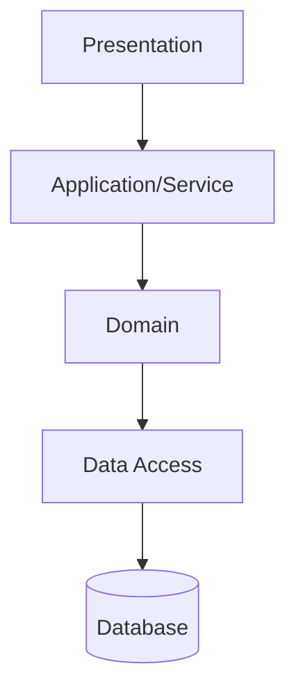
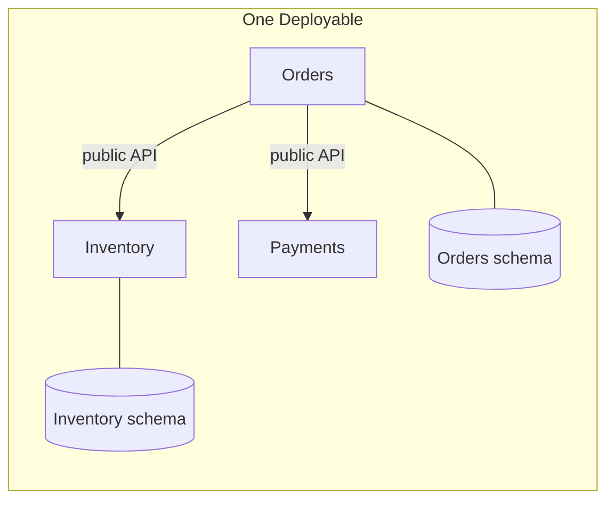
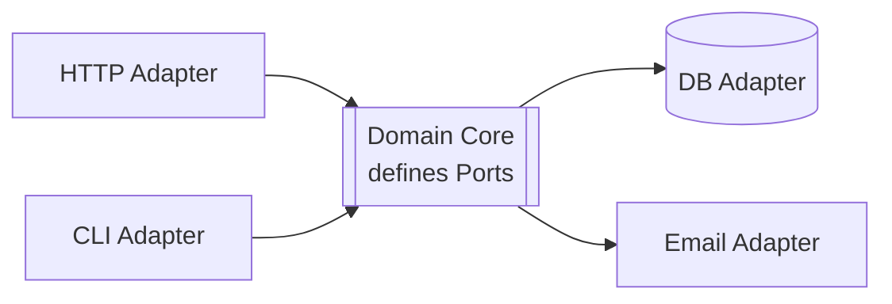
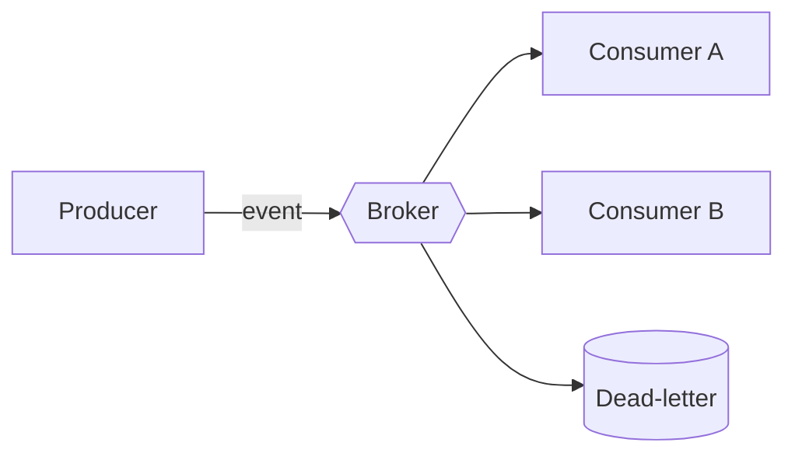
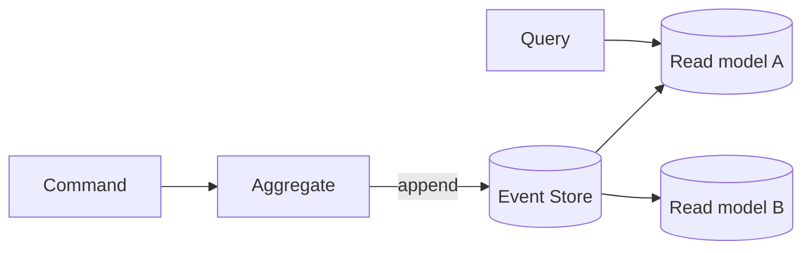
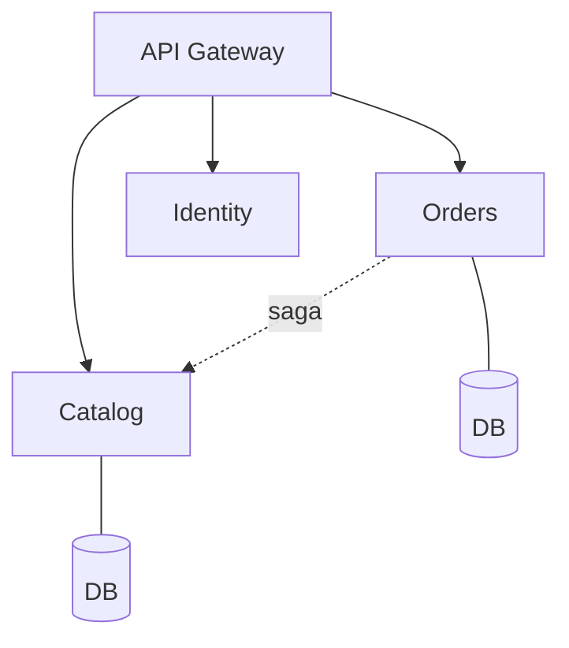
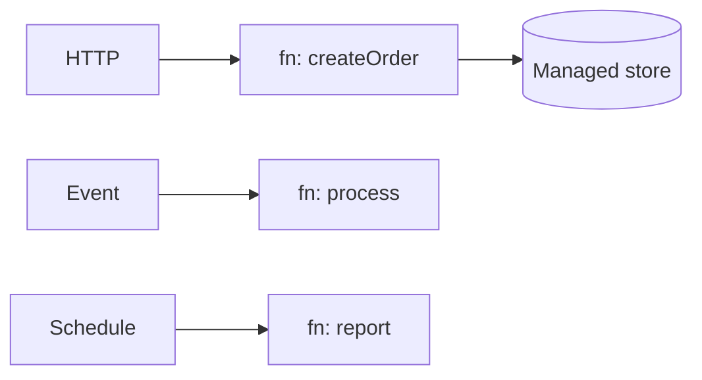
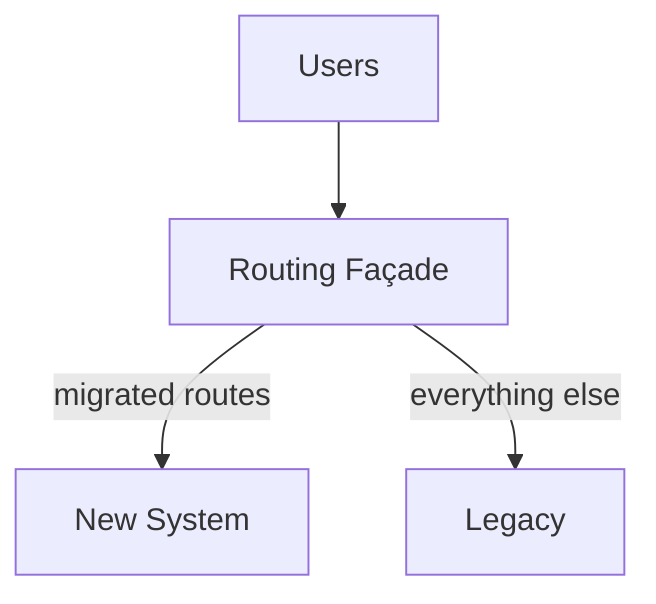
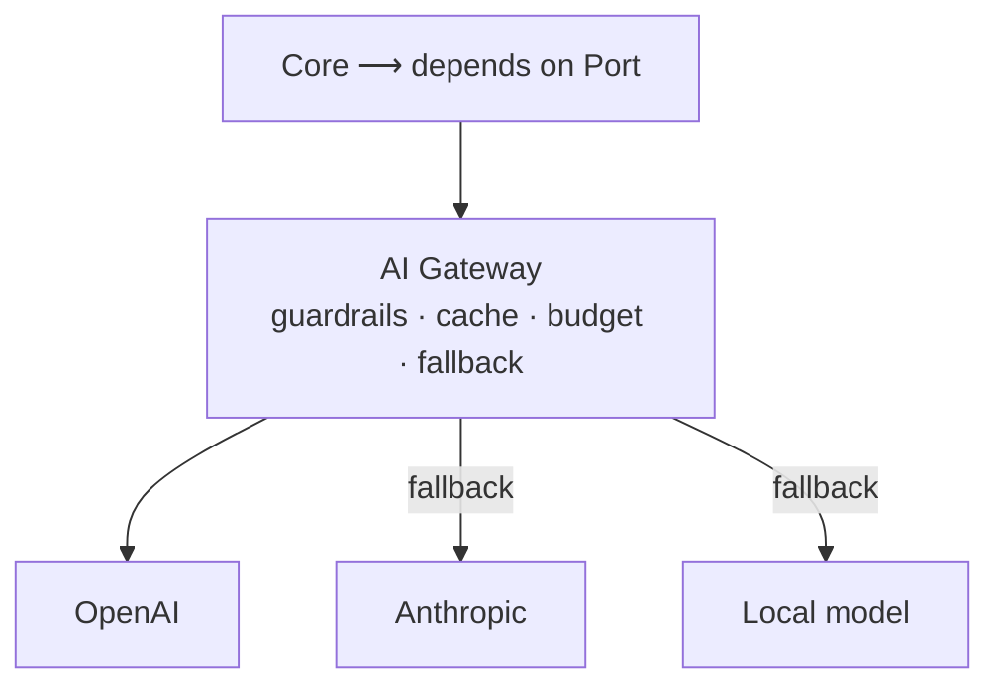
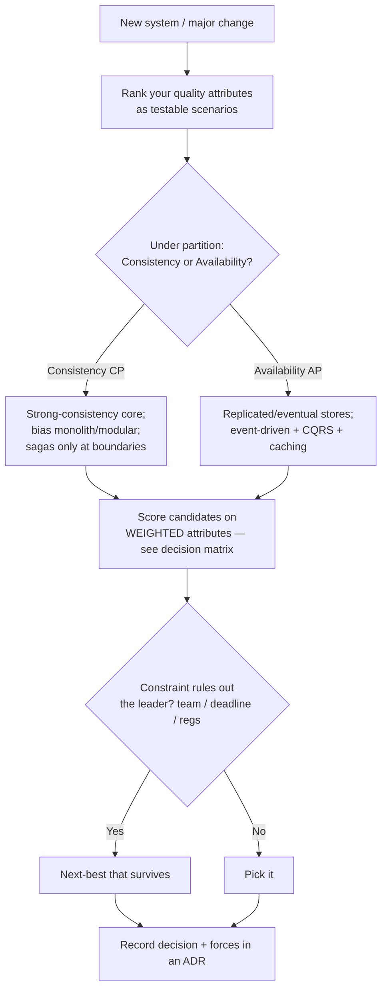

# System Architecture Catalog

> A working reference for practicing architects: the common system architectures **with diagrams**, the quality-attribute trade-offs that decide between them, and **runnable** reference implementations for each. Plus a decision method, a CAP/PACELC guide, an AI Gateway pattern for LLM integration, and complete end-to-end worked architectures (social media, banking, multi-region).

Maintained by [Ruchit Suthar](https://ruchitsuthar.com) — Software Architect & Technical Leader. 15+ years scaling systems from startup to enterprise.

📖 Companion essay: [Common System Architectures: A Reference Catalog Every Architect Should Know](https://ruchitsuthar.com/blog/software-architecture/common-system-architectures-reference-catalog/)

> ⭐ **If this catalog helps you make a better architecture decision, please star the repo** — it helps other engineers find it.

---

## Why this exists

Most teams reinvent the same handful of architectures from first principles — and often pick one because it's fashionable rather than because it fits. This repository is the antidote: a **decision-support tool**. For each pattern you get a diagram, the forces that make it fit, the quality attributes it serves and sacrifices, its failure modes and operational concerns, and runnable code that shows the structure in real terms.

The guiding principle throughout: **architecture is the ranking of quality attributes, made concrete. Complexity is a loan you pay interest on every day — take it only when the return justifies it.**

## Start here

| Doc | What it gives you |
|---|---|
| **[Choosing an Architecture](./docs/choosing-an-architecture.md)** | A quality-attribute decision method + the architecture decision matrix + weighted scoring |
| **[CAP, PACELC & Consistency Models](./docs/cap-theorem.md)** | How to position each data flow on the consistency/availability spectrum |
| **[Worked example — Social Media (AP)](./examples/social-media)** | A complete availability-first, eventually-consistent architecture |
| **[Worked example — Banking (CP)](./examples/banking)** | A complete consistency-first, audited architecture — the inverse |
| **[Worked example — Multi-Region SaaS](./examples/multi-region)** | Data residency (GDPR + India), active-active vs active-passive, failover |
| **[ADR template](./adr/0000-template.md)** | The format for recording an architecture decision and its forces |

## The catalog

Each pattern has a deep README (forces · quality-attribute profile · trade-offs · operational concerns · anti-patterns · references) and a **runnable** TypeScript reference with tests.

| # | Architecture | Use it when | Watch out for | Code |
|---|--------------|-------------|---------------|:----:|
| 1 | [Layered (N-tier)](./layered) | Small domain, ship fast | Logic leaking into controllers/DB; anemic domain | ✅ |
| 2 | [Modular Monolith](./modular-monolith) | **Default under ~30 engineers** | Boundaries eroding into a big ball of mud | ✅ |
| 3 | [Hexagonal (Ports & Adapters)](./hexagonal) | Complex, long-lived domain | Ceremony for a CRUD app | ✅ |
| 4 | [Event-Driven](./event-driven) | Independent, async reactions to a fact | Can't reason by reading code; non-idempotent consumers | ✅ |
| 5 | [CQRS + Event Sourcing](./cqrs-event-sourcing) | Asymmetric read/write; audit trail | Over-applied; eventual-consistency UX | ✅ |
| 6 | [Microservices](./microservices) | **30+ engineers**, independent deploys | Distributed monolith; technical boundaries | ✅ |
| 7 | [Serverless / FaaS](./serverless) | Spiky, event-driven, low-baseline | Cold starts; lock-in; cost inverts at scale | ✅ |
| 8 | [Strangler Fig](./strangler-fig) | Migrating legacy without a rewrite | Stalls at 60%; two systems forever | ✅ |
| 9 | [**AI Gateway / LLM Integration**](./ai-gateway) | **Adding LLMs without coupling to a vendor** | Vendor lock-in; cost runaway; prompt injection | ✅ |

## Visual catalog

Every pattern at a glance — the component structure that defines it.

### 1. Layered (N-tier)


### 2. Modular Monolith


### 3. Hexagonal (Ports & Adapters)


### 4. Event-Driven


### 5. CQRS + Event Sourcing


### 6. Microservices


### 7. Serverless / FaaS


### 8. Strangler Fig


### 9. AI Gateway / LLM Integration


## How to choose (the 30-second version)



Full method, matrix, and weighted scoring in **[docs/choosing-an-architecture.md](./docs/choosing-an-architecture.md)**.

## Running the references

Every code reference is zero-config beyond `npm install` (TypeScript via `tsx`, tests via the Node built-in test runner):

```bash
cd <pattern>      # e.g. ai-gateway, cqrs-event-sourcing, examples/multi-region
npm install
npm test          # runnable tests demonstrating the pattern's defining property
npm start         # a small demo
```

## Repository layout

```
docs/                      decision method, CAP/PACELC
adr/                       ADR template + worked examples
examples/
  social-media/            complete AP architecture (read-heavy, eventual)
  banking/                 complete CP architecture (correctness, audit)
  multi-region/            data-residency reference arch + runnable router
layered/  modular-monolith/  hexagonal/  event-driven/
cqrs-event-sourcing/  microservices/  serverless/  strangler-fig/  ai-gateway/
                           one folder per pattern: deep README + runnable code
```

## Status & roadmap

**v0.3** — 9 patterns with diagrams + runnable references; decision method; CAP guide; three complete worked architectures (social media, banking, multi-region). Roadmap:

- [ ] Language variants (Go, Java) for the most-deployed patterns (microservices, event-driven) — v0.4
- [ ] Infrastructure-as-Code companions for the cloud-native patterns
- [ ] More worked examples (real-time/IoT, marketplace)

Contributions welcome — see [CONTRIBUTING.md](./CONTRIBUTING.md).

## ⭐ Support

If this saved you a design review or helped you make a better call, **star the repo** so more engineers find it — and open an issue with the architecture decision you're wrestling with.

## License

[MIT](./LICENSE) © Ruchit Suthar
