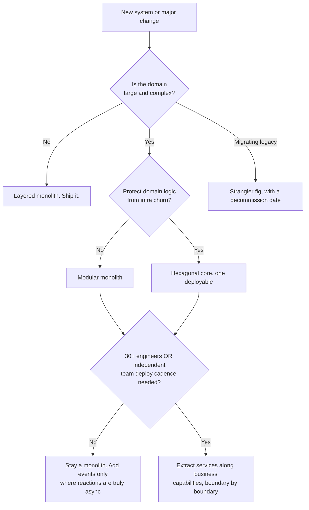

# System Architecture Catalog

> A practitioner's reference catalog of common software architectures — each with a diagram, the forces that make it the right choice, the failure mode that makes it the wrong one, and reference code you can read.

Maintained by [Ruchit Suthar](https://ruchitsuthar.com) — Software Architect & Technical Leader. 15+ years scaling systems from startup to enterprise.

📖 **Companion article:** [Common System Architectures: A Reference Catalog Every Architect Should Know](https://ruchitsuthar.com/blog/software-architecture/common-system-architectures-reference-catalog/)

---

## Why this exists

Most teams reinvent the same eight or nine architectures from scratch — often by cargo-culting a pattern that doesn't fit their forces. This repo is the reference I wish I'd had: not a "best architecture" ranking (there's no such thing), but a menu of patterns with honest trade-offs and runnable structure so you can pick on **fit**, not hype.

The guiding principle throughout: **complexity is a loan you pay interest on every day.** Take it when the return justifies it — not before. Most teams should stop simpler than they think.

## The catalog

Ordered roughly by the complexity they introduce. Start at the top.

| # | Architecture | Use it when | Watch out for |
|---|--------------|-------------|---------------|
| 1 | [Layered (N-tier)](./layered) | Small domain, need to ship, want a structure everyone understands | Business logic leaking into controllers/DB; anemic domain |
| 2 | [Modular Monolith](./modular-monolith) | **Default for most teams under ~30 engineers** — clean boundaries, no distribution tax | Boundaries not enforced → big ball of mud in a costume |
| 3 | [Hexagonal (Ports & Adapters)](./hexagonal) ✅ _runnable_ | Complex, long-lived domain; infra you expect to change | Ceremony for a CRUD app |
| 4 | [Event-Driven](./event-driven) ✅ _runnable_ | Genuinely independent, async reactions to the same fact | Can't reason by reading code; non-idempotent consumers |
| 5 | [CQRS + Event Sourcing](./cqrs-event-sourcing) | Asymmetric read/write; audit trail is a real requirement | Most over-applied "senior" pattern; eventual-consistency UX |
| 6 | [Microservices](./microservices) ✅ _runnable_ | **30+ engineers**, multiple teams needing independent deploy cadence | Distributed monolith; services drawn on technical, not business, lines |
| 7 | [Serverless / FaaS](./serverless) | Spiky, event-driven, low-baseline workloads | Cold starts; lock-in; cost flips at steady high throughput |
| 8 | [Strangler Fig](./strangler-fig) | Migrating a legacy system without a big-bang rewrite | Stalls at 60%; two systems forever with no decommission date |

## How to pick



Three principles behind the flowchart:

1. **Start with the simplest thing that could work, with explicit boundaries so you can change your mind.** Optimize for reversibility — a modular monolith can become microservices; the reverse is a rewrite.
2. **Distribute for organizational reasons, not technical ones.** If one team can hold the system in their heads, keep it in one process.
3. **Write down *why*.** Use the [ADR template](./adr/0000-template.md) to capture the forces behind each decision.

## Repository layout

```
.
├── layered/                # 3-layer service, dependency rule enforced
├── modular-monolith/       # modules with separate schemas + boundary test
├── hexagonal/              # domain core + ports + swappable adapters (runnable TS example)
├── event-driven/           # idempotent consumer + dead-letter queue
├── cqrs-event-sourcing/    # aggregate, event store, two projections
├── microservices/          # two services + saga + API gateway
├── serverless/             # IaC function pipeline with local emulation
├── strangler-fig/          # routing façade migrating one endpoint at a time
└── adr/                    # Architecture Decision Record template + examples
```

Each folder has a `README.md` with the diagram, the forces, the failure mode, and notes on the reference implementation. The [`hexagonal`](./hexagonal) folder includes a small **runnable** TypeScript example (domain logic tested with zero infrastructure, then the same feature wired to a real adapter) as the exemplar of the pattern.

## Status & roadmap

This is a living catalog (v0.1). The structure and READMEs are complete; reference implementations are being filled in pattern by pattern. Contributions welcome — see [CONTRIBUTING.md](./CONTRIBUTING.md).

- [x] Catalog structure + decision flowchart
- [x] Per-architecture READMEs with diagrams and trade-offs
- [x] ADR template + worked examples ([0001](./adr/0001-use-postgresql.md), [0002](./adr/0002-modular-monolith-over-microservices.md))
- [x] Runnable hexagonal reference (TypeScript)
- [x] Runnable event-driven reference (idempotent consumer + DLQ)
- [x] Runnable microservices saga reference (compensation on failure)
- [ ] Runnable references for the remaining patterns (layered, modular monolith, CQRS, serverless, strangler fig)
- [ ] Language variants (Go, Java) for the most-requested patterns

## License

[MIT](./LICENSE) © Ruchit Suthar
