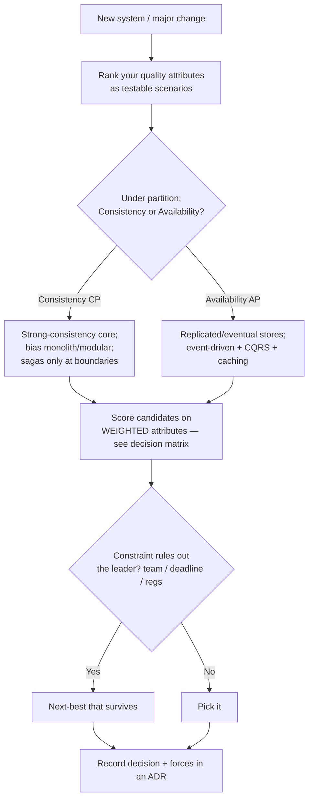

# System Architecture Catalog

> A working reference for practicing architects: the common system architectures, the quality-attribute trade-offs that decide between them, and **runnable** reference implementations for each. Plus a decision method, a CAP/PACELC guide, and two complete end-to-end worked architectures at opposite ends of the consistency spectrum.

Maintained by [Ruchit Suthar](https://ruchitsuthar.com) — Software Architect & Technical Leader. 15+ years scaling systems from startup to enterprise.

📖 Companion essay: [Common System Architectures: A Reference Catalog Every Architect Should Know](https://ruchitsuthar.com/blog/software-architecture/common-system-architectures-reference-catalog/)

---

## Why this exists

Most teams reinvent the same handful of architectures from first principles — and often pick one because it's fashionable rather than because it fits. This repository is the antidote: not a "best architecture" ranking (there is no such thing), but a **decision-support tool**. For each pattern you get the forces that make it fit, the quality attributes it serves and sacrifices, its failure modes and operational concerns, and runnable code that shows the structure in real terms.

The guiding principle throughout: **architecture is the ranking of quality attributes, made concrete. Complexity is a loan you pay interest on every day — take it only when the return justifies it.**

## Start here

| Doc | What it gives you |
|---|---|
| **[Choosing an Architecture](./docs/choosing-an-architecture.md)** | A quality-attribute decision method + the architecture decision matrix + weighted scoring |
| **[CAP, PACELC & Consistency Models](./docs/cap-theorem.md)** | How to position each data flow on the consistency/availability spectrum |
| **[Worked example — Social Media (AP)](./examples/social-media)** | A complete availability-first, eventually-consistent architecture, end to end |
| **[Worked example — Banking (CP)](./examples/banking)** | A complete consistency-first, audited architecture — the deliberate inverse |
| **[ADR template](./adr/0000-template.md)** | The format for recording an architecture decision and its forces |

## The catalog

Each pattern has a deep README (forces · quality-attribute profile · trade-offs · operational concerns · anti-patterns · references) and, where code clarifies it, a **runnable** TypeScript reference with tests.

| # | Architecture | Use it when | Watch out for | Code |
|---|--------------|-------------|---------------|:----:|
| 1 | [Layered (N-tier)](./layered) | Small domain, ship fast, structure everyone understands | Logic leaking into controllers/DB; anemic domain | ✅ runnable |
| 2 | [Modular Monolith](./modular-monolith) | **Default under ~30 engineers** — boundaries without the distribution tax | Boundaries eroding into a big ball of mud | ✅ runnable |
| 3 | [Hexagonal (Ports & Adapters)](./hexagonal) | Complex, long-lived domain; infra you expect to change | Ceremony for a CRUD app | ✅ runnable |
| 4 | [Event-Driven](./event-driven) | Genuinely independent, async reactions to a fact | Can't reason by reading code; non-idempotent consumers | ✅ runnable |
| 5 | [CQRS + Event Sourcing](./cqrs-event-sourcing) | Asymmetric read/write; audit trail is a real requirement | Most over-applied "senior" pattern; eventual-consistency UX | ✅ runnable |
| 6 | [Microservices](./microservices) | **30+ engineers**, independent deploy cadence | Distributed monolith; technical not business boundaries | ✅ runnable |
| 7 | [Serverless / FaaS](./serverless) | Spiky, event-driven, low-baseline workloads | Cold starts; lock-in; cost inverts at steady high load | ✅ runnable |
| 8 | [Strangler Fig](./strangler-fig) | Migrating legacy without a big-bang rewrite | Stalls at 60%; two systems forever | ✅ runnable |

## How to choose (the 30-second version)



Full method, matrix, and weighted scoring in **[docs/choosing-an-architecture.md](./docs/choosing-an-architecture.md)**.

## Running the references

Every code reference is zero-config beyond `npm install` (TypeScript via `tsx`, tests via the Node built-in test runner):

```bash
cd <pattern>      # e.g. cqrs-event-sourcing
npm install
npm test          # runnable tests demonstrating the pattern's defining property
npm start         # a small demo
```

## Repository layout

```
docs/                      decision method, CAP/PACELC
adr/                       ADR template + worked examples
examples/
  social-media/            complete AP architecture (read-heavy, eventual)
  banking/                 complete CP architecture (correctness, audit)
layered/  modular-monolith/  hexagonal/  event-driven/
cqrs-event-sourcing/  microservices/  serverless/  strangler-fig/
                           one folder per pattern: deep README + runnable code
```

## Status

v0.2 — all 8 patterns have deep READMEs and runnable references; decision method, CAP guide, and two complete worked architectures are in place. Roadmap: language variants (Go, Java) for the most-requested patterns; an infrastructure-as-code companion for the cloud-native patterns. Contributions welcome — see [CONTRIBUTING.md](./CONTRIBUTING.md).

## License

[MIT](./LICENSE) © Ruchit Suthar
