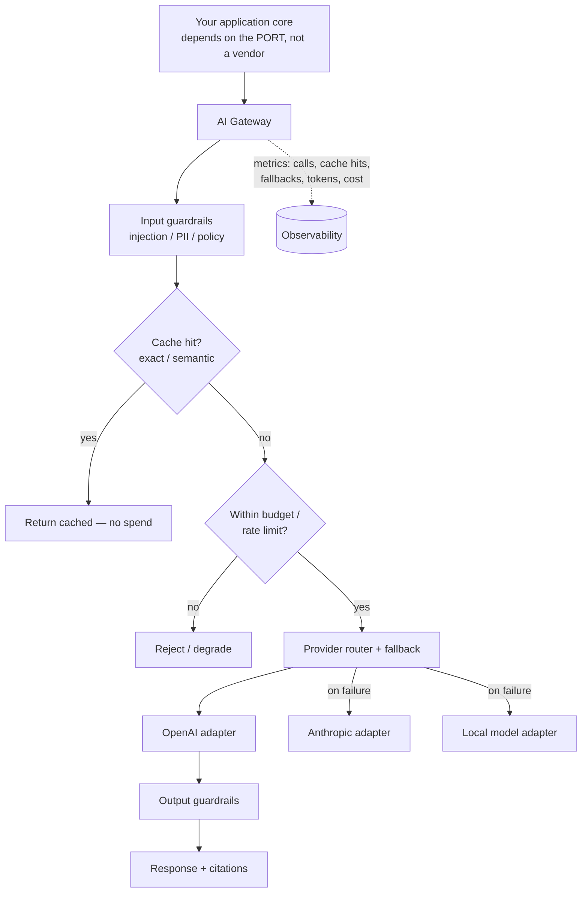

# AI Gateway / LLM Integration Pattern

> How do you add LLM capabilities to an existing system **without coupling your core to a single vendor** (OpenAI, Anthropic, Bedrock, a local model)? You put an **AI Gateway** between your application and the providers — one chokepoint that owns provider abstraction, fallback, caching, cost control, and guardrails. This is the integration pattern every team is figuring out in 2026, and it's a straightforward application of ports-and-adapters plus the resilience patterns you already know.



## Context & forces

Reach for an AI Gateway the moment **more than one part of your system calls an LLM**, or the moment you care about **vendor risk, cost, or safety** — which is immediately, in any serious product. The forces it resolves:

- **Vendor lock-in & outages** — providers go down, rate-limit you, deprecate models on their schedule, and change pricing. You need to swap or fail over without touching domain code.
- **Cost that scales with usage *and* abuse** — tokens cost money; an unbounded feature (or an attacker) can 5× your bill in a week.
- **Latency** — LLM calls are slow; caching identical/similar requests is a large, cheap win.
- **Safety** — prompt injection and disallowed output are real; you want one place to enforce guardrails, not N scattered call sites.
- **Coupling** — without a gateway, a vendor SDK ends up imported across your codebase, and your core is now married to that vendor.

## Quality-attribute profile

| Attribute | Rating | Note |
|---|:--:|---|
| Evolvability (vendor independence) | ●●● | Swap/add providers behind one port |
| Availability | ●●● | Fallback chain survives a provider outage |
| Cost control | ●●● | Central budget caps, rate limits, caching |
| Security | ●●○ | One enforcement point for in/out guardrails |
| Latency | ●●○ | Caching helps; the call itself is still slow |
| Operability | ●●○ | One place to observe all AI traffic — but it's on the hot path |

## Consequences & failure modes

The gateway is **critical infrastructure on the hot path** — it needs HA and observability of its own, and a bug there affects every AI feature. Other failure modes: **silent fallback hiding a degraded experience** (alert on fallback rate, don't just absorb it); **cache serving stale or wrong-context answers** (scope cache keys carefully, especially for RAG); and **treating the LLM as trusted** — the gateway must assume both the prompt *and the model output* are adversarial. If the model can trigger tools, the blast radius of an injection is whatever those tools can do.

## Operational concerns

- **Fallback chain**, timeouts, and circuit breakers per provider (the same [resilience patterns](https://ruchitsuthar.com/blog/software-architecture/caching-idempotency-retries-at-scale/) you use elsewhere).
- **Caching** — exact-match first; semantic caching for similar prompts can cut cost 30–50%.
- **Budget & rate limits** per user/tenant so usage (and abuse) can't run unbounded.
- **Guardrails** on input and output; treat retrieved RAG content as an injection vector too.
- **Observability & evals** — log the full chain (prompt, provider, tokens, cost, latency); run an [eval set](https://ruchitsuthar.com/blog/software-architecture/llm-evals-building-the-regression-net/) on prompt/model/provider changes so a swap doesn't silently regress quality.
- **Prompt & model versioning** — manage prompts and pinned model versions centrally; provider model updates change behavior.

## Anti-patterns

- **Calling the vendor SDK directly from domain code** — the coupling this pattern exists to prevent.
- **No fallback / no budget** — one provider incident or one abusive user becomes your incident.
- **Trusting model output** — letting raw output trigger a privileged action without validation.
- **A gateway with no observability** — you can't debug or cost-attribute what you can't see.

## What to look at (runnable reference)

- [`src/port.ts`](./src/port.ts) — the stable `LlmProvider` port your core depends on (never a vendor SDK).
- [`src/providers.ts`](./src/providers.ts) — adapters per vendor (deterministic fakes here; wrap real SDKs in production).
- [`src/gateway.ts`](./src/gateway.ts) — the gateway: provider **fallback**, **caching**, **budget cap**, **in/out guardrails**, and **metrics** — the five cross-cutting concerns in one place.
- [`src/gateway.test.ts`](./src/gateway.test.ts) — proves provider-agnosticism, cache avoids double-spend, fallback survives a primary outage, the budget cap refuses over-spend, and guardrails block injection/leakage.

```bash
cd ai-gateway && npm install && npm test
```

## Related patterns & references

- Built on → [Hexagonal](../hexagonal) (ports/adapters) + [resilience patterns](https://ruchitsuthar.com/blog/software-architecture/caching-idempotency-retries-at-scale/); pairs with [Event-Driven](../event-driven) for async AI workloads.
- Companion articles: [Designing LLM-Powered Features](https://ruchitsuthar.com/blog/software-architecture/designing-llm-powered-features/), [Evals for LLM Features](https://ruchitsuthar.com/blog/software-architecture/llm-evals-building-the-regression-net/), [RAG in Production](https://ruchitsuthar.com/blog/software-architecture/rag-in-production-chunking-reranking-hybrid-search/).
