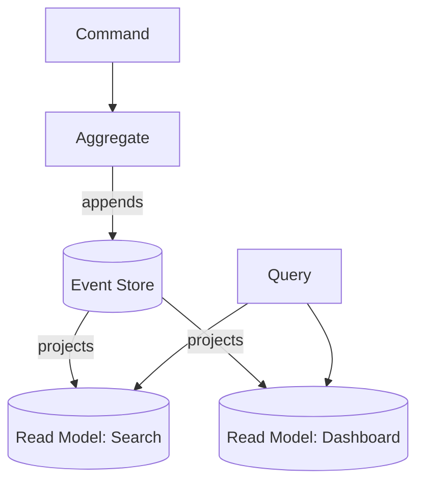

# CQRS + Event Sourcing

Two **separable** patterns that often travel together. **CQRS** splits the write model (commands) from the read model (queries) so each is optimized independently. **Event sourcing** stores state as an append-only log of immutable events; current state is a fold over that log.



## Context & forces

Reach for CQRS when read and write workloads are **wildly asymmetric** (write once, query a thousand ways) and need different models. Add **event sourcing** when an **immutable audit trail** or **time-travel state reconstruction** is a genuine requirement — finance, healthcare, anything regulated — or when you want read models you can rebuild by replaying history.

## Quality-attribute profile

| Attribute | Rating | Note |
|---|:--:|---|
| Auditability | ●●● | The log *is* the audit trail (with ES) |
| Read scalability / latency | ●●● | Purpose-built, independently scaled read models |
| Evolvability | ●●○ | Add read models by replaying; event schema evolution is hard |
| Consistency (read side) | ●○○ | Projections are eventually consistent |
| Operability | ●○○ | More moving parts; replays, snapshots, projection lag |

## Consequences & failure modes

**The most over-applied "senior" pattern.** Adopted for a todo app, event sourcing surfaces the genuinely hard problems: eventual-consistency UX ("I saved it — why isn't it there?"), **event schema evolution** (old events are immutable; you must keep reading them forever), and slow projection rebuilds over millions of events (mitigate with **snapshots**). The pragmatic middle is frequently **CQRS *without* event sourcing** — separate read/write models over a normal database.

## Operational concerns

- **Snapshots** to bound rebuild time; **idempotent projections** (replays and at-least-once delivery).
- **Schema/versioning** for events from day one (upcasting strategy).
- **Read-model lag** monitoring; expose freshness where users care.
- **Recovery:** a corrupted read model is fixed by *replaying* the log — a major operational advantage.

## Anti-patterns

- **Event sourcing for CRUD** — taking on the hard problems for no audit/temporal benefit.
- **No snapshots** — O(all events) rebuilds that get slower forever.
- **Leaking eventual consistency into UX** that demanded read-your-writes.

## What to look at (runnable reference)

- [`src/aggregate.ts`](./src/aggregate.ts) — the **write side**: a `BankAccount` that enforces the no-overdraft invariant, emits events, and **rehydrates from its event stream**.
- [`src/event-store.ts`](./src/event-store.ts) — append-only store; the only write op is `append`.
- [`src/projections.ts`](./src/projections.ts) — the **read side**: independent balance and statement projections.
- [`src/ledger.test.ts`](./src/ledger.test.ts) — proves the invariant holds, read models build from the stream, **state is fully rebuilt by replay**, and a *new* projection can be added and back-filled from history alone.

```bash
cd cqrs-event-sourcing && npm install && npm test
```

## Related patterns & references

- Pairs with → [Event-Driven](../event-driven); applied in the [banking example](../examples/banking) (ledger) and [social-media example](../examples/social-media) (rebuildable read models).
- Greg Young (CQRS/ES talks); Fowler — *Event Sourcing*, *CQRS*; Vernon — *Implementing Domain-Driven Design*.
