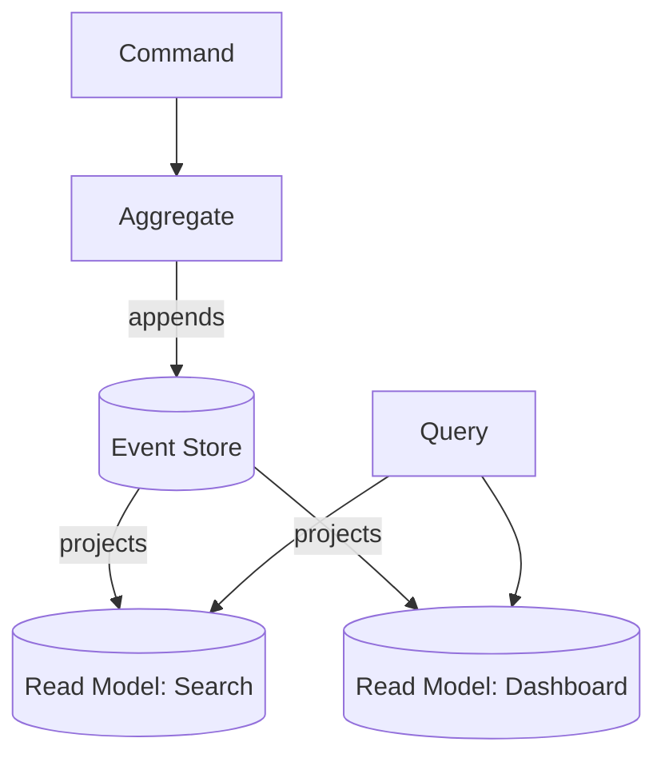

# CQRS + Event Sourcing

Two patterns that travel together but are **separable**.

- **CQRS** splits the write model (commands) from the read model (queries) so each can be optimized independently.
- **Event Sourcing** stores state as an append-only log of events; current state is a fold over that log.

## Use it when
- Read and write workloads are wildly asymmetric (write a trade once, query it a thousand ways).
- You need a perfect audit trail and the ability to reconstruct state at any point in time (finance, healthcare, regulated domains).
- You want to answer questions you didn't know to ask at design time — because you kept every fact.

## How it goes wrong
The **most over-applied "senior" pattern.** Teams adopt event sourcing for a todo app and meet the hard problems:
- Eventual consistency confuses users ("I saved it, why isn't it there?").
- Schema evolution of old events is genuinely difficult.
- Rebuilding projections over millions of events is slow.

## The pragmatic middle
**CQRS *without* event sourcing** is often the sweet spot — separate read/write models, normal database. Reach for full event sourcing only when the audit log is a real business requirement, not an aesthetic preference.

## What to look at (reference implementation)
An aggregate that emits events, an append-only event store, and two independent projections built from the same event stream.

> Implementation: scaffolded. See the [companion article](https://ruchitsuthar.com/blog/software-architecture/common-system-architectures-reference-catalog/); contributions welcome.
