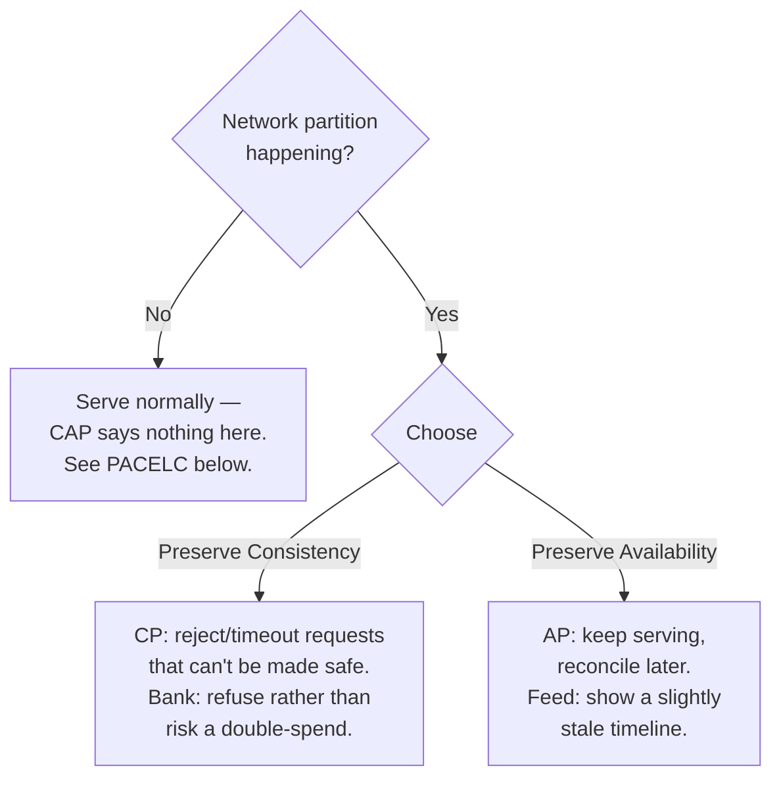
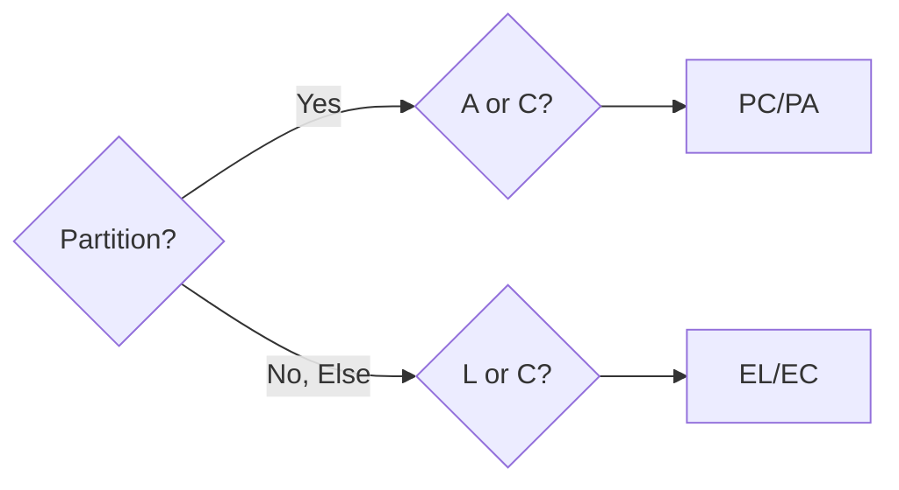
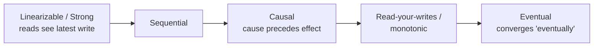

# CAP, PACELC, and Consistency Models: The Architect's Guide

> CAP is the most cited and most misunderstood theorem in distributed systems. This guide states it precisely, corrects the common misreadings, extends it with PACELC (the part that governs your system the other 99.9% of the time), maps the full consistency spectrum, and shows how the choice drives concrete datastore and architecture decisions — with the [banking](../examples/banking) (CP) and [social media](../examples/social-media) (AP) examples as anchors.

---

## 1. The theorem, stated correctly

For a distributed data store, during a **network partition** (P) you can guarantee at most one of:

- **Consistency (C)** — every read sees the most recent write (this is *linearizability*, not the "C" in ACID).
- **Availability (A)** — every request to a non-failing node gets a non-error response.

**You do not "pick 2 of 3."** Partitions are not optional — in any real network, partitions *will* happen (a switch dies, a region link drops, GC pauses look like a partition). So P is a given. The real, narrow statement is:

> **When a partition occurs, you must choose: stay Consistent (reject some requests → sacrifice A) or stay Available (serve possibly-stale data → sacrifice C).**

That's it. CAP is a decision you make about *behavior under partition*, not a personality type for your whole system.

## 2. The three misconceptions to unlearn

1. **"Pick 2 of 3."** Misleading. P is mandatory; you choose between C and A *under* partition. The honest framing is CP vs AP.
2. **It's not global or permanent.** CAP is *per operation* and *per moment*. A system can serve some operations CP (transfers) and others AP (display a like count) — most real systems are a mix. You position each *data flow*, not the whole company.
3. **The "C" is not ACID's "C".** CAP-C is linearizability (a recency/ordering guarantee across nodes). ACID-C is "transactions preserve invariants." A single-node ACID database isn't even in CAP's scope until you replicate it.

## 3. PACELC — the part that runs your system 99.9% of the time

Partitions are rare. So CAP is silent most of the time. **PACELC** (Abadi) completes the picture:

> **If Partition (P): choose A or C. Else (E): choose Latency (L) or Consistency (C).**

Even with no partition, *synchronous* replication for strong consistency costs latency (you wait for replicas to ack); *asynchronous* replication is fast but lets reads go stale. So your everyday trade-off is **latency vs consistency**, and that's often the more consequential decision than the rare-partition one.

Classifications (PACELC) for systems you'll meet:

| System | PACELC | Plain English |
|---|---|---|
| Traditional RDBMS (single primary, sync replica) | **PC/EC** | Consistent under partition *and* normally; pays latency |
| PostgreSQL / MySQL (typical) | PC/EC | Strong consistency first |
| Spanner / CockroachDB | PC/EC | Strong consistency globally, latency cost (managed via TrueTime/clocks) |
| DynamoDB (default), Cassandra | **PA/EL** | Available + low latency; eventual consistency by default (tunable) |
| Cassandra (tunable) | PA/EL→EC | Quorum reads/writes can buy consistency at latency cost |
| Redis (replica reads) | PA/EL | Fast, may read stale from replicas |

**The architect's takeaway:** "Which database is CAP-consistent?" is the wrong question. Ask: *for this specific data flow, under partition do I need C or A, and normally do I need low latency or strong consistency?* Then pick a store whose defaults (and tuning knobs) match.

## 4. The consistency spectrum (it's not binary)

"Consistent vs eventually consistent" is a false binary. The useful spectrum, strongest to weakest:

- **Linearizable (strong):** as if one copy, real-time order. Needed for: balances, inventory, locks, uniqueness. Expensive (coordination, latency).
- **Causal:** if A causes B, everyone sees A before B. Great middle ground — a reply never appears before the comment it answers. Much cheaper than linearizable.
- **Read-your-writes / monotonic reads:** you always see your own latest action; you never go backwards in time. Often the *real* UX requirement behind "it must be consistent."
- **Eventual:** replicas converge given no new writes. Fine for like counts, view counts, recommendations, search indexes.

**Senior move:** most "we need strong consistency" requirements are actually "we need read-your-writes" or "we need causal." Linearizability is the most expensive guarantee; spend it only where an invariant truly requires it (money, stock, uniqueness).

## 5. Mapping CAP to architecture decisions

| If the data flow needs… | Choose | Architecture/datastore implications |
|---|---|---|
| An invariant that must never break (no double-spend, no oversell) | **CP, linearizable** | Single-primary ACID DB or consensus store (Spanner/Cockroach); transactions; avoid eventual reads on the invariant; sagas only with compensation + idempotency |
| Maximum uptime & low latency, staleness tolerable | **AP, eventual/causal** | Replicated/partitioned stores (Dynamo/Cassandra), caches, CQRS read models, event-driven propagation |
| Correct *ordering* without full strong consistency | **Causal** | Versioned events, vector clocks, causal stores; event sourcing |
| "User sees their own action immediately" | **Read-your-writes** | Route the user's reads to the primary / their own region; sticky sessions; write-through cache |

## 6. Real systems are polyglot — position each flow

The mature pattern is not "we are a CP company." It's: **decompose the system into data flows and position each one.** A single product routinely contains both:

- **Banking** (overall CP, see [example](../examples/banking)): the ledger and transfers are linearizable CP. But statements, notifications, and analytics are AP/eventual — nobody's account breaks if the monthly-statement PDF lags by a minute.
- **Social media** (overall AP, see [example](../examples/social-media)): the timeline, like counts, and follower counts are AP/eventual. But *authentication*, *username uniqueness*, and *payment for ads* are CP/linearizable — you can't let two people grab the same handle during a partition.

So the deliverable isn't one CAP label. It's a table: *flow → consistency requirement → store → CAP/PACELC position.* That table is a hallmark of a senior design.

## 7. Worked positioning

**Banking transfer (CP / linearizable):**
> Under partition, the transfer service **refuses** rather than risk debiting an account twice or allowing an overdraft. Availability is sacrificed for correctness — a declined transfer is recoverable; a double-spend may not be. Backed by an ACID, single-primary (or consensus) ledger with strict serializable isolation on the affected accounts, idempotency keys to make retries safe, and reconciliation as a backstop.

**Social feed read (AP / eventual):**
> Under partition, the timeline service **keeps serving** the last known feed from a replica/cache. A slightly stale timeline is fine; an error page is not. Backed by replicated read models (CQRS), populated asynchronously from a write log; convergence within seconds is acceptable. Authentication for the same user, however, is routed CP.

## 8. Checklist for your design review

- [ ] Have you listed each significant **data flow** and its consistency requirement (linearizable / causal / read-your-writes / eventual)?
- [ ] For each, stated the **CP-vs-AP behavior under partition** explicitly?
- [ ] Stated the **PACELC "else" trade-off** (latency vs consistency in the normal case)?
- [ ] Chosen datastores whose **defaults and tuning** match those positions?
- [ ] Confirmed you're not paying for **linearizability where causal or read-your-writes** would do?
- [ ] Captured the positioning in an [ADR](../adr/0000-template.md)?

## References

- Gilbert & Lynch — formal proof of CAP (2002).
- Abadi — *Consistency Tradeoffs in Modern Distributed Database System Design* (PACELC).
- Kleppmann — *Designing Data-Intensive Applications*, ch. 5 & 9 (replication, consistency, linearizability).
- Bailis et al. — *Highly Available Transactions* (the spectrum between strong and eventual).
- Helland — *Life Beyond Distributed Transactions* (idempotence, activities, sagas).
