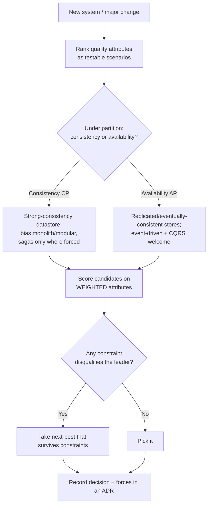

# Choosing an Architecture: A Quality-Attribute Decision Method

> Architecture is the set of decisions that are expensive to change. You don't choose a "best" architecture — you choose the one whose trade-offs best satisfy your dominant quality attributes under your real constraints. This document gives you a repeatable method, a decision matrix, and a weighted-scoring technique to make that choice defensible rather than fashionable.

Audience: architects and senior engineers making a structural decision they'll have to live with for years. Companion to the [CAP / PACELC guide](./cap-theorem.md) and the two worked examples ([social media](../examples/social-media), [banking](../examples/banking)).

---

## 1. Architecture is driven by quality attributes, not features

Features tell you *what* the system does. **Quality attributes** (the "-ilities", a.k.a. non-functional requirements) tell you *how well*, and they are what actually drive structure. Two products with identical feature lists but different quality-attribute priorities need different architectures.

The architecturally significant quality attributes:

| Attribute | The question it answers | Architectural pressure it creates |
|---|---|---|
| **Scalability** | Can it grow with load, data, users? | Statelessness, partitioning, async, horizontal scale |
| **Availability** | What % uptime; survives failures? | Redundancy, isolation, graceful degradation |
| **Consistency** | How fresh/correct must reads be? | Transaction boundaries, CAP positioning, replication strategy |
| **Latency / performance** | How fast per operation? | Caching, locality, read models, fewer network hops |
| **Durability** | Can we ever lose committed data? | Replication, write-ahead logs, backups, ledgers |
| **Security** | Confidentiality, integrity, authZ/authN | Trust boundaries, least privilege, isolation |
| **Maintainability / evolvability** | Cost to change safely? | Modularity, clear boundaries, low coupling |
| **Operability** | Can we run, observe, debug it? | Observability, simplicity, blast-radius control |
| **Cost (TCO)** | Build + run economics | Managed vs self-host, utilization, complexity tax |
| **Time-to-market** | How fast to first value? | Simplicity, fewer moving parts, boring tech |
| **Compliance / auditability** | Regulatory obligations | Immutable logs, data residency, segregation of duties |
| **Team topology fit** | Does it match org structure? | Conway's Law — boundaries should match teams |

> **The core move of architecture: rank these for *your* system.** You cannot maximize all of them — they trade off (consistency vs availability, simplicity vs scalability, time-to-market vs evolvability). Architecture is the art of deciding which to optimize and which to sacrifice, on purpose.

## 2. The method (six steps)

1. **Elicit the dominant quality attributes.** Write quality-attribute *scenarios*, not adjectives. Not "must be scalable" but "must serve 50k read req/s at p99 < 150ms with 99.95% availability across two regions." Scenarios are testable; adjectives are arguments.
2. **Rank and weight them.** Force a priority order. If everything is critical, nothing is. Assign weights (see §4).
3. **Identify the binding constraints.** Team size and skills, deadline, budget, existing systems, regulatory regime, data residency. Constraints eliminate options before preferences do.
4. **Determine CAP/PACELC positioning** for the data that matters. Under a network partition, does this system favor consistency or availability? (See [CAP guide](./cap-theorem.md).) This single decision shapes the datastore and the architecture.
5. **Score candidate architectures** against the weighted attributes (the matrix, §3–4).
6. **Record the decision and the forces in an ADR** ([template](../adr/0000-template.md)). The reasoning is worth more than the choice.

## 3. The architecture decision matrix

How each catalog architecture tends to serve each quality attribute. Ratings: ●●● strong, ●●○ moderate, ●○○ weak. **These are tendencies, not laws** — a skilled team can push any of them, and your weighting is what matters.

| Architecture | Scalability | Availability | Consistency | Latency | Maintainability | Operability | Cost (low TCO) | Time-to-market | Best-fit team size |
|---|:--:|:--:|:--:|:--:|:--:|:--:|:--:|:--:|---|
| [Layered monolith](../layered) | ●○○ | ●●○ | ●●● | ●●○ | ●●○ | ●●● | ●●● | ●●● | 1–10 |
| [Modular monolith](../modular-monolith) | ●●○ | ●●○ | ●●● | ●●● | ●●● | ●●● | ●●● | ●●○ | 5–30 |
| [Hexagonal](../hexagonal) | ●●○ | ●●○ | ●●● | ●●○ | ●●● | ●●○ | ●●○ | ●●○ | any (a style) |
| [Event-driven](../event-driven) | ●●● | ●●● | ●○○ | ●●○ | ●●○ | ●○○ | ●●○ | ●○○ | 10+ |
| [CQRS + event sourcing](../cqrs-event-sourcing) | ●●● | ●●○ | ●○○* | ●●● | ●●○ | ●○○ | ●○○ | ●○○ | 10+ |
| [Microservices](../microservices) | ●●● | ●●● | ●○○ | ●●○ | ●●○† | ●○○ | ●○○ | ●○○ | 30+ |
| [Serverless / FaaS](../serverless) | ●●● | ●●● | ●●○ | ●●○‡ | ●●○ | ●●○ | ●●●§ | ●●● | any |
| [Strangler fig](../strangler-fig) | — | — | — | — | ●●● | ●●○ | ●●○ | ●●○ | migration |

\* Event sourcing gives a perfect *audit* consistency (the log) but query-side reads are eventually consistent.
† Microservices improve maintainability *per service* but add system-level complexity; net effect depends on boundaries.
‡ Serverless latency suffers from cold starts on spiky/idle paths.
§ Serverless cost is excellent at low/spiky volume and can invert at steady high throughput.

**How to read it:** scan *down* your top-2 weighted columns. The architectures that score ●●● there are your shortlist. Then check that none of your *constraints* (team size, deadline) rule them out.

## 4. Weighted scoring (make it defensible)

Ratings alone hide the fact that attributes aren't equally important to *you*. Weighted scoring fixes that:

1. Assign each quality attribute a weight (e.g., 1–5) reflecting its importance **to your system**.
2. Score each candidate architecture 1–3 on each attribute (use the matrix as a starting point, adjust for your context).
3. Multiply and sum. Highest weighted total is your leading candidate — and now you have the math to defend it in review.

**Worked example — a consistency-critical fintech ledger** (weights chosen for *that* system):

| Attribute | Weight | Modular monolith | Microservices |
|---|:--:|:--:|:--:|
| Consistency | 5 | 3 → **15** | 1 → 5 |
| Auditability | 5 | 3 → **15** | 2 → 10 |
| Time-to-market | 4 | 3 → **12** | 1 → 4 |
| Operability | 4 | 3 → **12** | 1 → 4 |
| Scalability | 2 | 2 → 4 | 3 → **6** |
| **Weighted total** | | **58** | **29** |

The modular monolith wins *for this system* — not in general, but because consistency, audit, and operability were weighted heavily and scale was not the binding constraint. Re-weight for a read-heavy social feed and microservices + event-driven win easily. **The weights encode the architecture decision; the matrix just scores it.**

## 5. Constraints trump preferences

Before you fall in love with a score, apply the eliminators. A constraint can disqualify the highest-scoring option outright:

- **Team size & skill.** Microservices with a 6-person team is an own-goal regardless of score. Match architecture to [team topology](https://teamtopologies.com/) and Conway's Law.
- **Deadline.** If you must ship in 8 weeks, event sourcing's learning curve disqualifies it.
- **Regulation.** Data residency or audit requirements can force isolation or immutability.
- **Existing systems.** Greenfield vs strangler-fig migration is a different decision entirely.
- **Operational maturity.** Don't run microservices without the platform (CI/CD, observability, on-call) to operate them.

## 6. The anti-patterns (how architecture decisions go wrong)

- **Resume-driven development** — choosing the architecture that looks good on a CV, not the one that fits.
- **Hype-driven / cargo-cult** — "Netflix does microservices" (you are not Netflix, and even Netflix started as a monolith).
- **Maximizing every attribute** — produces over-engineered systems that ship slowly and operate poorly.
- **Premature distribution** — taking on network failures, distributed transactions, and multi-service debugging before you have the organizational problem distribution solves.
- **Architecture by default** — picking what's "in the air" without ranking a single quality attribute.

## 7. Decision flow

## See it applied

The two worked examples take opposite positions on almost every attribute and show this method end to end:

- **[Social media platform](../examples/social-media)** — availability/latency dominant, **AP**, eventually consistent, read-heavy → microservices + event-driven + CQRS + heavy caching.
- **[Banking / core ledger](../examples/banking)** — consistency/auditability dominant, **CP**, strong consistency → modular boundaries + double-entry event-sourced ledger + sagas + idempotency.

## References

- Bass, Clements, Kazman — *Software Architecture in Practice* (quality-attribute scenarios, ATAM).
- Ford, Parsons, Kua — *Building Evolutionary Architectures* (fitness functions).
- Richards & Ford — *Fundamentals of Software Architecture* (trade-off analysis).
- Kleppmann — *Designing Data-Intensive Applications* (consistency, replication, partitioning).
- Skelton & Pais — *Team Topologies* (Conway's Law as a design tool).
