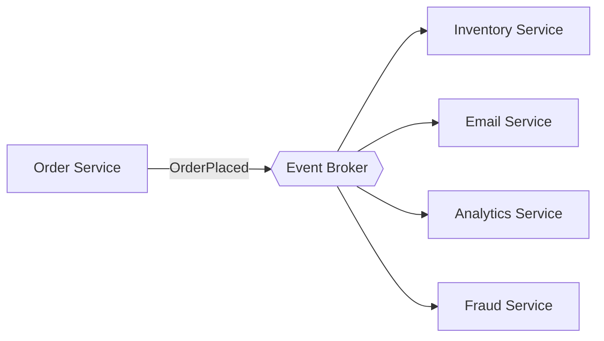

# Event-Driven Architecture

Components communicate by producing and consuming **events** (facts about something that happened) through a broker — Kafka, RabbitMQ, SQS/SNS, NATS — instead of calling each other directly. Producers don't know who consumes; consumers don't know who produced. The defining property is **inversion of dependency**.



## Context & forces

Reach for events when **reactions to a fact are genuinely independent and asynchronous** (order placed → reserve stock, email, analytics, fraud), when you need **temporal decoupling / load buffering** (a spike fills the queue instead of toppling a consumer), or when a **replayable audit log** is itself valuable. Not for "we have microservices" or "it's scalable" — those are not reasons.

## Quality-attribute profile

| Attribute | Rating | Note |
|---|:--:|---|
| Scalability | ●●● | Producers/consumers scale independently; buffering |
| Availability | ●●● | Consumer down ≠ producer down; loose coupling |
| Evolvability | ●●● | Add consumers without touching producers |
| Consistency | ●○○ | Eventual by nature |
| Operability | ●○○ | Hard to trace; choreography spread across services |

## Consequences & failure modes

You trade *legibility* for decoupling: a request that used to be one stack trace becomes a choreography across services and a broker, and "why didn't the email send?" becomes archaeology. The two classic failures: **using events for request/response** (RPC with extra latency and no error path — if the caller needs the answer, make a synchronous call), and **non-idempotent consumers** (at-least-once delivery means duplicates *will* happen → double-charges).

## Operational concerns (the non-negotiables)

- **Idempotent consumers** — record processed event IDs in the same transaction as the side effect; brokers deliver at-least-once.
- **Dead-letter queue** — poison messages go somewhere visible and alertable, never dropped or retried forever.
- **Versioned schemas** — events are a cross-team contract; a schema registry + backward-compatible-only evolution.
- **Observability** — correlation IDs across the chain; lag and DLQ-depth dashboards on every consumer.
- **Choreography vs orchestration** — simple fan-out → choreography; multi-step transactions needing compensation → an orchestrated [saga](../microservices).

## Anti-patterns

- **Events as RPC** — awaiting a reply on a queue.
- **No idempotency / no DLQ** — the two omissions that cause data corruption and outages.
- **Event-driven everything** — async coordination where a direct call would be simpler and clearer.

## What to look at (runnable reference)

- [`src/broker.ts`](./src/broker.ts) — in-memory broker modeling **at-least-once delivery** and a **dead-letter queue**.
- [`src/consumer.ts`](./src/consumer.ts) — payment consumer whose two defenses are **idempotency** and recording the ID with the side effect.
- [`src/consumer.test.ts`](./src/consumer.test.ts) — proves a redelivered event charges **once**, a poison message lands in the DLQ, and unrelated events are ignored.

```bash
cd event-driven && npm install && npm test
```

## Related patterns & references

- Pairs with → [CQRS + Event Sourcing](../cqrs-event-sourcing), [Microservices](../microservices) (saga).
- Companion article: [Event-Driven Architecture Without the Hype](https://ruchitsuthar.com/blog/software-architecture/event-driven-architecture-without-the-hype/).
- Hohpe & Woolf — *Enterprise Integration Patterns*; Kleppmann — *DDIA* (stream processing).
