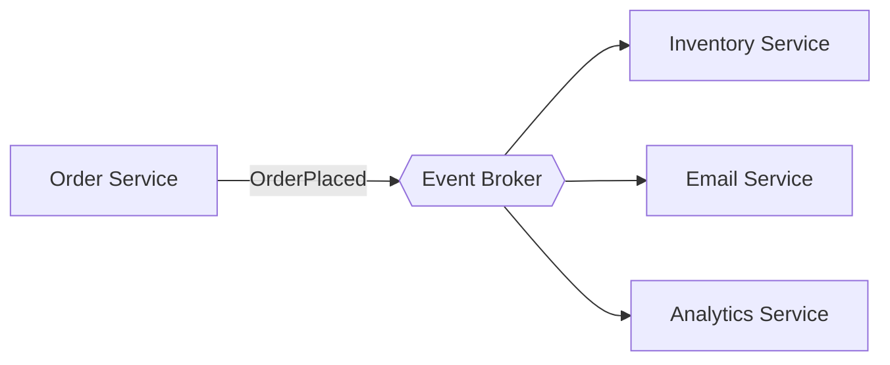

# Event-Driven Architecture

Components communicate by producing and consuming events through a broker (Kafka, RabbitMQ, SNS/SQS) instead of calling each other directly. Producers don't know who consumes; consumers don't know who produced.

## Use it when
- You have genuinely independent reactions to the same fact (`OrderPlaced` → reserve stock, send email, update analytics, run fraud check).
- You want to add new reactions without touching the producer.
- Workflows are asynchronous by nature; you want buffering against load spikes and an audit trail.

## How it goes wrong
You lose the ability to reason about the system by reading code — one stack trace becomes a choreography across five services and a broker. Two specific traps:
1. **Using events for request/response** flows that actually need an answer now. That's RPC with extra latency and no error path.
2. **Non-idempotent consumers.** A redelivered event charges the customer twice.

## The non-negotiable rule
**Every consumer must be idempotent.** Brokers deliver at-least-once. Design for duplicate and out-of-order delivery from day one.

Key tactics:
- **Idempotency keys** — record processed event IDs; skip duplicates.
- **Dead-letter queue (DLQ)** — events that fail repeatedly go somewhere visible, not into a retry storm.
- **Schema/versioning** — events are a contract; evolve them carefully.

## What to look at (reference implementation)
A producer/consumer pair with idempotency keys and a dead-letter queue, showing safe handling of duplicate delivery.

> Implementation: scaffolded. See the [companion article](https://ruchitsuthar.com/blog/software-architecture/common-system-architectures-reference-catalog/); contributions welcome.
