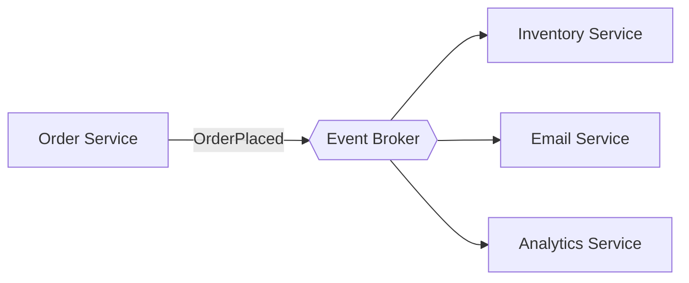

# Event-Driven Architecture

Components communicate by producing and consuming events through a broker (Kafka, RabbitMQ, SNS/SQS) instead of calling each other directly. Producers don't know who consumes; consumers don't know who produced.



## Use it when
- You have genuinely independent reactions to the same fact (`OrderPlaced` → reserve stock, send email, update analytics, run fraud check).
- You want to add new reactions without touching the producer.
- Workflows are asynchronous by nature; you want buffering against load spikes and an audit trail.

## How it goes wrong
You lose the ability to reason about the system by reading code — one stack trace becomes a choreography across five services and a broker. Two specific traps:
1. **Using events for request/response** flows that actually need an answer now. That's RPC with extra latency and no error path.
2. **Non-idempotent consumers.** A redelivered event charges the customer twice.

## The non-negotiable rule
**Every consumer must be idempotent.** Brokers deliver at-least-once. Design for duplicate and out-of-order delivery from day one.

Key tactics:
- **Idempotency keys** — record processed event IDs; skip duplicates.
- **Dead-letter queue (DLQ)** — events that fail repeatedly go somewhere visible, not into a retry storm.
- **Schema/versioning** — events are a contract; evolve them carefully.

## What to look at (runnable reference)

This folder contains a **runnable** TypeScript example.

- [`src/broker.ts`](./src/broker.ts) — a tiny in-memory broker that models the two facts that trip teams up: **at-least-once delivery** (the same event can arrive twice) and a **dead-letter queue** (events that fail `maxAttempts` times go somewhere visible instead of being dropped or retried forever).
- [`src/consumer.ts`](./src/consumer.ts) — the payment consumer. Its two lines of defense are **idempotency** (remembers processed event IDs, skips duplicates) and recording the ID *with* the side effect (one transaction in prod).
- [`src/consumer.test.ts`](./src/consumer.test.ts) — proves a redelivered event charges **once**, a poison message lands in the **DLQ**, and unrelated events are ignored.

### Run it

```bash
cd event-driven
npm install
npm test     # 3 tests: idempotency, dead-lettering, type filtering
npm start    # demo: a duplicated order + a poison message
```

The key line to read is the idempotency check in `consumer.ts` — that single guard is the difference between "resilient to the network" and "double-charges customers one in two thousand times."

Companion article: [Event-Driven Architecture Without the Hype](https://ruchitsuthar.com/blog/software-architecture/event-driven-architecture-without-the-hype/).
