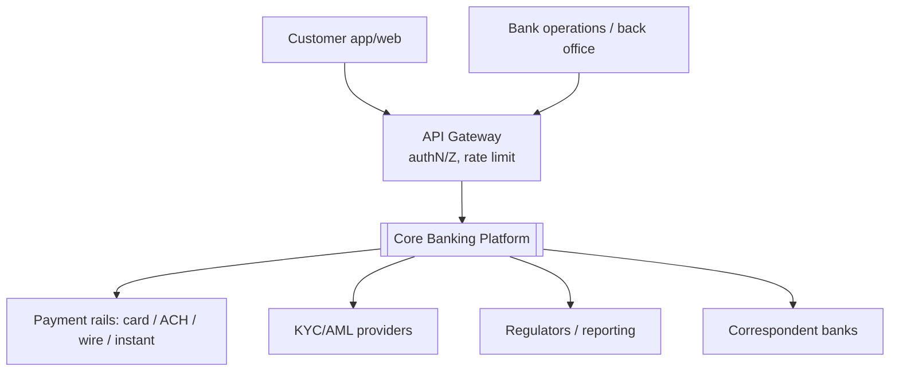
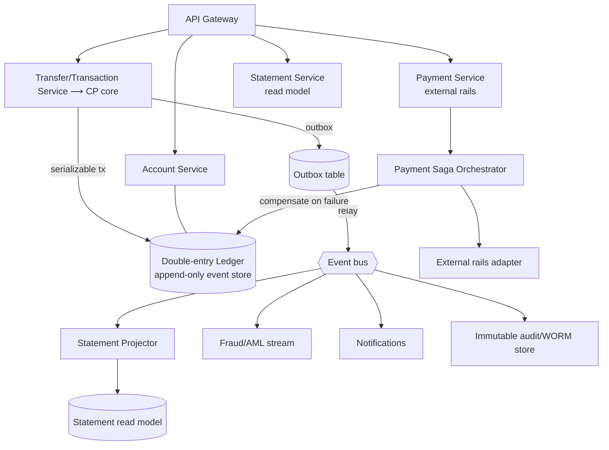
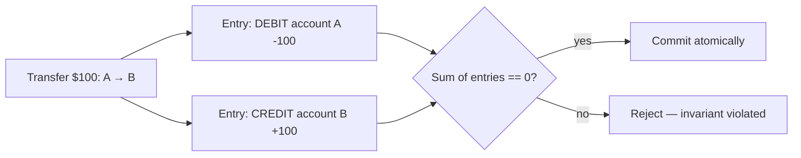
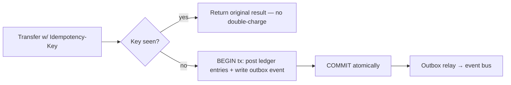
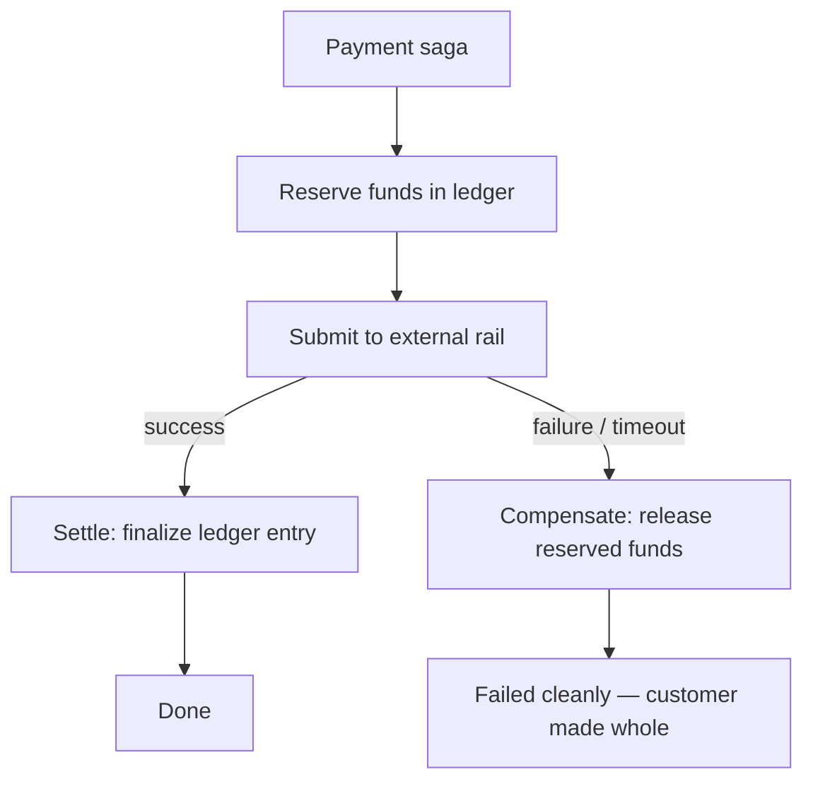

# Reference Architecture: A Core Banking / Payments Platform (CP / correctness-first)

> A complete, senior-level architecture for a core banking and payments system — the canonical **consistency, durability, and auditability-first** system, and the deliberate inverse of the [social media platform](../social-media). Where the feed chooses availability and tolerates staleness, the ledger chooses correctness and will **refuse service rather than risk a wrong balance**. This document applies the [decision method](../../docs/choosing-an-architecture.md) and [CAP guide](../../docs/cap-theorem.md): requirements → quality attributes → CAP positioning → C4 → the double-entry event-sourced ledger → consistency, idempotency, outbox, sagas → compliance, resilience, ADRs.

---

## 1. Context & scope

A core banking platform: customer accounts, a money **ledger**, internal transfers, external payments (card/ACH/wire/instant rails), statements, and regulatory reporting.

**The forcing function here is correctness, not scale:**

| Dimension | Assumption |
|---|---|
| Accounts | 20M |
| Transactions/day | ~50M (modest QPS vs social — *correctness* is the hard part, not volume) |
| Peak transfer rate | ~5k req/s |
| Consistency requirement | **Linearizable** on balances and transfers |
| Durability | **Zero tolerance** for committed-data loss |
| Auditability | Every monetary change immutable & traceable (regulatory) |
| Availability target | 99.99% — but **correctness wins ties** under partition |
| Regulatory | PCI-DSS, SOX, AML/KYC, data residency, segregation of duties |

> The number that matters isn't 50M/day — it's **zero**: zero lost transactions, zero double-spends, zero unexplained balance changes. That single constraint dictates nearly every decision below.

## 2. Quality attributes, ranked

The inverse of the [social ranking](../social-media):

1. **Consistency / correctness** (linearizable balances) — a wrong balance is an existential failure. Top priority, non-negotiable.
2. **Durability** — a committed transaction must survive anything.
3. **Auditability / compliance** — every change immutable, attributable, reconstructable (SOX, audit).
4. **Security** — money is the adversary's target; defense in depth.
5. **Availability** (99.99%) — important, but **under partition we sacrifice availability to preserve consistency** (CP).
6. **Latency** — sub-second is fine; we will gladly trade latency for correctness (PACELC: EC).

Sacrificed on purpose: **availability under partition** (we'd rather decline a transfer than risk a double-debit) and **latency** (synchronous, strongly-consistent writes). Note these are *exactly* the attributes the social platform optimized — opposite system, opposite choices.

## 3. CAP / PACELC positioning — per data flow

| Data flow | Consistency needed | CAP under partition | PACELC (normal) | Store |
|---|---|---|---|---|
| **Account balance read** | Linearizable | **CP** | **EC** | ACID RDBMS (primary) |
| **Money transfer / debit** | Linearizable, serializable | **CP** — refuse if unsafe | EC | ACID ledger, serializable isolation |
| **Ledger (record of truth)** | Linearizable + immutable | **CP** | EC | Append-only event-sourced ledger |
| **External payment (rails)** | Eventual + saga + idempotent | CP intent, async settle | EC | Saga orchestrator + outbox |
| Statement generation | Eventual (read model) | AP | EL | Projection from ledger |
| Notifications | Eventual | AP | EL | Queue + KV |
| Fraud/AML scoring | Eventual (near-real-time) | AP | EL | Stream processor |
| Regulatory reporting | Strong (point-in-time correct) | CP (from immutable log) | EC | Replay event-sourced ledger |

> The platform is **CP overall** for everything touching money, with a few genuinely-eventual *derived* views (statements, notifications, analytics) positioned AP — because a statement PDF lagging a minute breaks nothing, but a balance off by a cent breaks the bank.

## 4. C4 — Context and Container views

### System context

### Container view

**Overall style:** carefully **bounded services around a strongly-consistent core**, *not* a sprawl of microservices. The money core (accounts + ledger + transfers) is kept in **one consistency domain** — often a [modular monolith](../../modular-monolith) or a single tightly-bounded service — so transfers can use a real ACID transaction instead of a distributed one. Services split off only where they don't need to share the money transaction (statements, notifications, fraud, external rails). This is the [decision method](../../docs/choosing-an-architecture.md) applied: with consistency weighted highest, distribution of the core is a liability, not an asset.

## 5. The core: a double-entry, event-sourced ledger

The heart of the system, and where senior judgment shows.

### Double-entry bookkeeping (the invariant)

Every transaction is recorded as balanced **debits and credits across accounts that must sum to zero.** Money is never created or destroyed, only moved. This 700-year-old accounting invariant is enforced in code: a transfer that doesn't balance is rejected.

### Event sourcing (the audit & correctness mechanism)

The ledger is an **append-only log of immutable entries** — you never update or delete a balance, you append entries; the current balance is a fold over the entries (often with periodic snapshots for performance). This is [event sourcing](../../cqrs-event-sourcing), and it's chosen here not for fashion but because it directly satisfies the top quality attributes:

- **Auditability:** the log *is* the audit trail — every change, immutable, ordered, attributable. SOX/regulatory reconstruction = replay.
- **Correctness/recovery:** you can recompute any balance at any point in time; corruption in a read model is fixed by replay.
- **Temporal queries:** "what was this balance on March 1st?" is a natural query.

Reads (current balance, statements) are **CQRS projections** off the ledger. A linearizable "current balance" projection is kept in the same consistency domain; eventually-consistent projections (statements) are built asynchronously.

> Note the symmetry with [social media](../social-media): both use event sourcing/CQRS, but for opposite reasons — social to enable *availability and rebuildable caches*; banking to enable *immutable auditability and provable correctness*. Same pattern, inverted motivation.

## 6. Consistency, idempotency, and exactly-once effects

Money demands that retries and partial failures never duplicate or lose a transaction.

- **Serializable isolation** on the affected accounts for transfers — no lost updates, no phantom overdrafts. Under contention we accept latency/abort-retry; under partition we **refuse** (CP).
- **Idempotency keys** on every money-moving request. A client retry (timeout, double-submit) with the same key returns the *original* result and never charges twice. (See [idempotency deep-dive](https://ruchitsuthar.com/blog/software-architecture/caching-idempotency-retries-at-scale/).) This is the single most important reliability pattern in the system.
- **Transactional outbox** for publishing events: the ledger write *and* the "TransferCompleted" event are committed in the **same database transaction** (event written to an outbox table), then a relay publishes to the bus. This guarantees the event is emitted **if and only if** the money moved — no "charged but no event" or "event but no charge." Avoids the dual-write problem entirely.

## 7. External payments: the saga (where you can't have one transaction)

Internal transfers use a single ACID transaction. **External** payments (card networks, ACH, wires) cross systems you don't control and can take seconds to days — you *cannot* hold a database transaction across them. Here, and only here, you use a [saga](../../microservices) with explicit compensation:

Key disciplines: **reserve-then-settle** (never debit before confirmation), idempotent rail submission (rails redeliver), reconciliation jobs that compare internal ledger vs rail statements daily, and a definite terminal state for every payment. The runnable [microservices saga demo](../../microservices) implements exactly this reserve/compensate shape.

## 8. Resilience & failure modes (CP = "fail safe, not fail open")

| Failure | Behavior |
|---|---|
| Network partition to the ledger primary | **Reject** new transfers in the affected partition (CP). A declined transfer is recoverable; a double-spend may not be. |
| Transfer request retried (client timeout) | Idempotency key returns the original outcome — never double-applied |
| Crash mid-transfer | Atomic transaction either fully committed or not at all; outbox ensures event matches state |
| External rail times out | Saga compensates; funds released; reconciliation backstops |
| Read-model (statement) lag | Acceptable — statements are AP/eventual |
| Data center loss | Synchronous replication to a standby in-region (RPO≈0); documented RTO; tested failover/DR |

Cross-cutting: WORM (write-once-read-many) storage for the audit log, daily **reconciliation** (internal ledger vs rails vs accounts must agree), and "fail closed" defaults everywhere money is involved.

## 9. Security & compliance (first-class, not bolted on)

- **PCI-DSS:** tokenize card data; minimize the cardholder-data environment; network segmentation.
- **AML/KYC:** identity verification on onboarding; transaction monitoring stream for suspicious activity.
- **SOX / auditability:** immutable event-sourced ledger + WORM audit store = provable history.
- **Segregation of duties:** maker-checker on high-value/operational actions; no single human can both initiate and approve.
- **Defense in depth:** mTLS service-to-service, least-privilege access, encryption at rest and in transit, comprehensive audit logging of *access*, not just changes.
- **Data residency:** account data stored in-jurisdiction where required.

## 10. Why NOT microservices-everywhere here

A common, expensive mistake is to split the money core into many services "for scalability." That would turn an atomic transfer into a **distributed transaction** — which doesn't exist in any usable form — forcing sagas onto the *core* invariant where a database transaction would have given you correctness for free. With consistency weighted highest and volume modest, the [decision matrix](../../docs/choosing-an-architecture.md) clearly favors keeping the money core in one consistency domain. Distribute the *non-money* concerns (statements, notifications, fraud, external rails) — not the ledger. This restraint is the senior call.

## 11. Key architectural decisions (ADR summaries)

- **ADR: CP positioning for all money flows.** Under partition, refuse rather than risk incorrect balances. *Trade-off:* reduced availability during partitions — accepted, because correctness is existential. ([ADR-0001 PostgreSQL](../../adr/0001-use-postgresql.md) and [ADR-0002 modular monolith](../../adr/0002-modular-monolith-over-microservices.md) capture related decisions.)
- **ADR: Double-entry, event-sourced ledger.** Immutability + double-entry give auditability and provable correctness; balances are folds/projections. *Trade-off:* more complex than CRUD balances; mitigated by snapshots.
- **ADR: Idempotency keys + transactional outbox on every money move.** Exactly-once *effects* despite retries and at-least-once messaging. *Trade-off:* extra storage and a relay process.
- **ADR: Sagas only at external boundaries.** Internal = one ACID transaction; external rails = reserve/settle/compensate saga. *Trade-off:* reconciliation overhead; accepted as unavoidable for cross-system money.
- **ADR: Keep the money core in one consistency domain.** Resist premature microservice decomposition of the ledger. *Trade-off:* the core scales vertically/by partition rather than by service split — fine at this volume.

## 12. Patterns used (map to the catalog)

- [Modular monolith](../../modular-monolith) — the money core in one consistency domain
- [CQRS + event sourcing](../../cqrs-event-sourcing) — immutable ledger + balance/statement projections
- [Microservices](../../microservices) + **saga** — external payment rails with compensation
- [Event-driven](../../event-driven) — outbox-relayed events to statements/fraud/audit (idempotent consumers)
- [Hexagonal](../../hexagonal) — ports/adapters to isolate the domain from rails and stores
- [Strangler fig](../../strangler-fig) — the realistic path for migrating off a legacy core banking mainframe

## 13. What makes this a CP system (the one-paragraph summary)

Because correctness, durability, and auditability are the top quality attributes and a wrong balance is existential, every money flow is positioned **CP / linearizable**: the system will refuse service under partition rather than risk a double-spend, records money in an immutable double-entry event-sourced ledger for provable audit, and makes every operation idempotent with a transactional outbox so retries and partial failures can never duplicate or lose money. Strong consistency is the default and availability/latency are the negotiated trade-offs — the exact mirror image of the [social media platform](../social-media), and the clearest demonstration that **architecture is the ranking of quality attributes, made concrete.**
