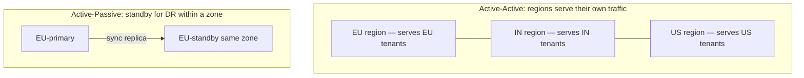
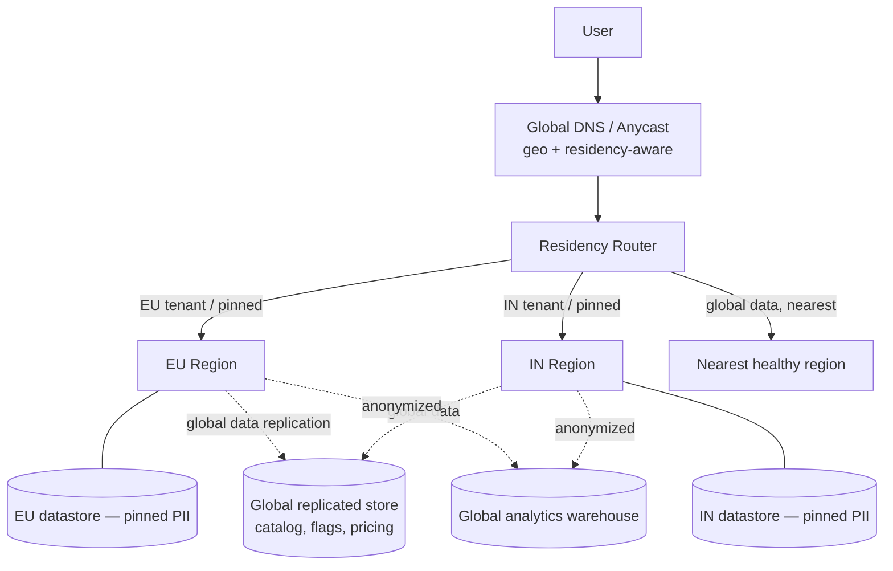
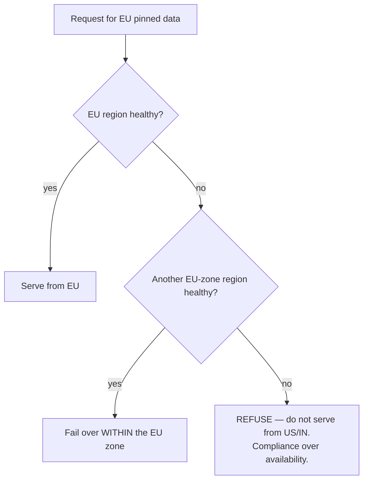

# Reference Architecture: Multi-Region SaaS with Data Residency (EU + India + US)

> The architecture enterprises pay for: *"we must be compliant in the EU and India simultaneously, stay available, and stay fast."* This is a complete reference for a **multi-region SaaS** that satisfies **data residency** (GDPR, India DPDP) while choosing deliberately between **active-active and active-passive**, and routing every request to a region that's both healthy and compliant. The hard rule throughout: **under failure, residency-pinned data fails over only within its own residency zone — we refuse rather than violate the law.** Code companion to the [GDPR / data-localization article](https://ruchitsuthar.com/blog/technical-leadership/building-for-compliance-gdpr-data-localization/).

---

## 1. Context & the forcing function

A B2B SaaS with customers in the EU, India, and the US. The binding constraint isn't scale — it's **law**:

- **GDPR (EU):** personal data of EU residents must be stored/processed in the EU (or under strict transfer mechanisms).
- **India DPDP / sectoral localization:** certain data must remain in India.
- Simultaneously: **99.99% availability**, low latency per region, and a single product/codebase.

This is a *compliance-first* architecture. Residency requirements shape data placement, routing, replication, and failover — everything below follows from them.

## 2. Quality attributes, ranked

1. **Compliance / data residency** — a residency breach is a regulatory and existential event. Top priority.
2. **Availability** (99.99%) — regional isolation so one region's failure doesn't take down others.
3. **Latency** — serve users from a nearby region (PACELC: favor latency for non-pinned data).
4. **Operability** — running N regions multiplies operational surface; keep it manageable.
5. **Consistency** — strong *within* a region; cross-region is eventual for global data (you cannot have low-latency strong consistency across continents).

## 3. The core decision: classify data, then place it

You do **not** make one global residency choice. You classify **each data category** and place it accordingly — the multi-region equivalent of the [per-flow CAP positioning](../../docs/cap-theorem.md):

| Data category | Example | Placement | Cross-region? |
|---|---|---|---|
| **Residency-pinned PII** | EU customer profiles, payment identities | Pinned to the tenant's home region | **Never leaves the zone** |
| **Regional operational** | EU orders, EU audit logs | Home region (replicated within zone) | Within zone only |
| **Global / non-personal** | product catalog, feature flags, pricing rules | Replicated to all regions | Yes (eventual) |
| **Aggregated/anonymized** | analytics, metrics | Global warehouse (after anonymization) | Yes (post-anonymization) |

The architecture's job is to enforce this classification at routing, storage, and replication time — not to trust application code to remember.

## 4. Active-Active vs Active-Passive (choose per concern)



| | Active-Active | Active-Passive |
|---|---|---|
| **What** | Every region serves live traffic for its tenants | One region serves; a standby waits |
| **Availability** | Highest — region failure sheds only that region's tenants | Lower — failover delay (RTO) |
| **Cost** | Higher (all regions hot) | Lower (standby idle) |
| **Complexity** | Higher (multi-writer concerns) | Lower |
| **Best for** | Global product, tenants spread across regions | DR within a residency zone |

**The pragmatic combination used here:** **active-active *across* residency zones** (EU, IN, US each serve their own tenants — natural isolation and latency), and **active-passive *within* a zone** for DR (an EU-standby in another EU AZ/region, so EU failover never leaves the EU). This satisfies residency *and* availability without a global multi-writer database.

## 5. Architecture (container view)



The **residency router** is the keystone (see the runnable demo). Every request carries the tenant's residency zone and the data classification; the router picks a region that satisfies both health and residency.

## 6. Replication & consistency

- **Residency-pinned data:** replicated **only within its zone** (e.g., EU-west ↔ EU-central) for DR. Never cross-zone. Strong consistency within the zone.
- **Global data:** asynchronously replicated to all regions; **eventually consistent** (a pricing-rule change propagates in seconds). Reads are local and fast; the rare write goes to a designated primary and fans out.
- **No cross-continent strong consistency** — physics (latency) and law (residency) both forbid it. Don't try.

## 7. Failover (the compliance-critical part)



This is the rule the runnable router enforces and tests: **residency-pinned data fails over only within its zone; if no in-zone region is healthy, the request is refused** rather than served from a non-compliant region. Global data, by contrast, may fail over anywhere. This is a deliberate, documented CP-style trade-off for the pinned subset.

## 8. Operational & security concerns

- **Routing correctness is a compliance control** — test it (the demo does) and monitor for any cross-zone serving of pinned data; alert as a security incident.
- **Per-region observability** + a global control plane; never centralize *pinned* logs cross-zone (logs contain PII).
- **Encryption & key management per region/zone** (keys don't leave the zone either).
- **Right-to-erasure (GDPR):** deletion must propagate through the zone's stores, replicas, backups (tombstones), and be excluded from global analytics.
- **Data-transfer mechanisms** (SCCs, adequacy) for any unavoidable cross-border flow — minimize these by design.

## 9. Key architectural decisions (ADR summaries)

- **ADR: Classify data; place by classification.** Pinned PII per zone; global data replicated; analytics anonymized-then-global. *Trade-off:* no single global database; app must be residency-aware (enforced centrally by the router).
- **ADR: Active-active across zones, active-passive within.** Residency + availability without multi-writer global consistency. *Trade-off:* cross-zone data is eventually consistent.
- **ADR: Refuse rather than violate residency on failover.** Pinned data never leaves its zone, even during an outage. *Trade-off:* reduced availability for the pinned subset during a zone-wide failure — accepted, because a breach is worse than a brief outage.

## 10. Patterns used (map to the catalog)

- [Strangler fig](../../strangler-fig) — the router/facade shape (route by attribute, fail over, roll back).
- [Microservices](../../microservices) / [Modular monolith](../../modular-monolith) — per-region deployments.
- [Event-driven](../../event-driven) — async global-data replication and anonymized analytics pipelines.
- [CAP / PACELC](../../docs/cap-theorem.md) — per-data-category consistency positioning.

## 11. Runnable reference

- [`src/residency.ts`](./src/residency.ts) — the residency-aware router: routes by tenant zone + data classification + region health, and **refuses to fail residency-pinned data over to a non-compliant region**.
- [`src/residency.test.ts`](./src/residency.test.ts) — EU pinned data stays in the EU (even when the user prefers US); India pinned data stays in India; pinned data **refuses** when its zone is down; global data optimizes for latency and fails over anywhere.

```bash
cd examples/multi-region && npm install && npm test
```

## 12. One-paragraph summary

Because data residency is the top quality attribute, this architecture classifies every data category and places it deliberately — pinned PII per residency zone, global data replicated, analytics anonymized — then runs **active-active across zones** (for residency isolation and latency) and **active-passive within a zone** (for DR that never leaves the zone). A residency-aware router enforces, on every request, that pinned data is served only from a compliant, healthy region, **refusing service rather than violating residency under failure.** It's the concrete, runnable answer to "be compliant in the EU and India simultaneously" — the question CTOs ask right before they hire an architect.
