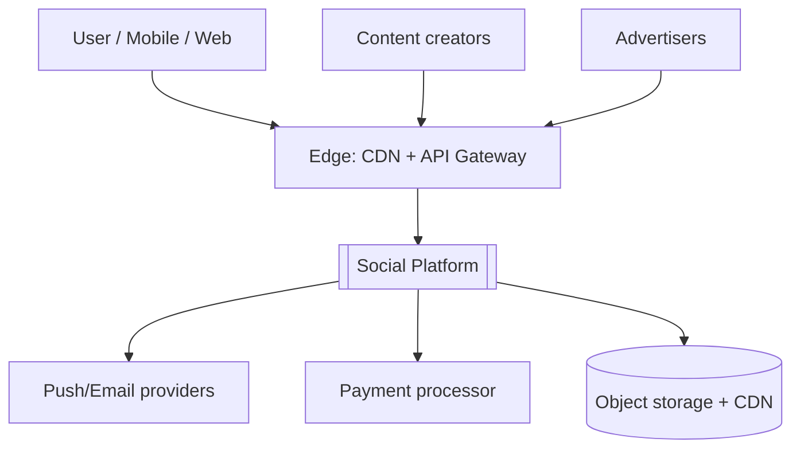
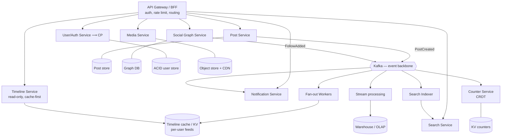

# Reference Architecture: A Social Media Platform (AP / read-heavy / global)

> A complete, senior-level architecture for a large social platform — the canonical **availability-and-latency-first, eventually-consistent** system. This document takes the [decision method](../../docs/choosing-an-architecture.md) and [CAP guide](../../docs/cap-theorem.md) and applies them end to end: requirements → quality attributes → CAP positioning per flow → C4 views → data architecture → the feed fan-out problem → scaling, resilience, security, cost → key ADRs. Contrast it with the [banking architecture](../banking), which sits at the opposite end of almost every axis.

---

## 1. Context & scope

A social platform: users create short posts with media, follow each other, and consume a personalized timeline; plus likes, comments, notifications, search, and trends.

**Scale assumptions (the forcing function):**

| Dimension | Assumption |
|---|---|
| Registered users | 200M |
| Daily active users | 30M |
| Read:write ratio | ~100:1 (timeline reads dominate everything) |
| Peak timeline reads | ~150k req/s |
| Posts/day | ~30M |
| Median fan-out (followers) | ~200; **p99.9 "celebrity" fan-out: 50M+** |
| Media | billions of objects, global delivery |
| Latency target | timeline p99 < 200ms globally |
| Availability target | 99.95% for read paths |

These numbers are the architecture. A 1,000-user version of this product should be a [modular monolith](../../modular-monolith); the design below is justified only by this scale.

## 2. Quality attributes, ranked

The ranking *is* the architecture decision (see [method §1](../../docs/choosing-an-architecture.md)):

1. **Availability** (99.95%+ reads) — a down feed is a lost user. Highest priority.
2. **Latency** (p99 < 200ms global) — engagement is latency-sensitive; locality matters.
3. **Scalability** (read-heavy, viral spikes) — must absorb 100:1 reads and celebrity fan-out.
4. **Evolvability / team autonomy** — hundreds of engineers shipping independently.
5. **Cost efficiency** — at this scale, per-request cost is a P&L line.
6. **Consistency** — **deliberately low priority for the social graph and feed.** Eventual/causal is fine; a like count off by one for two seconds harms nothing.

Sacrificed on purpose: **strong consistency** on feeds, counts, and the graph. Preserved where it matters: auth, handle uniqueness, and ad billing (see §4).

## 3. CAP / PACELC positioning — per data flow

There is **no single CAP label.** The senior deliverable is the per-flow table (see [CAP guide §6](../../docs/cap-theorem.md)):

| Data flow | Consistency needed | CAP under partition | PACELC (normal) | Store |
|---|---|---|---|---|
| Timeline / feed read | Eventual | **AP** — serve stale | EL — favor latency | Redis/KV read model + CDN |
| Post creation | Read-your-writes for author | AP (author sees own post via primary) | EL | Write store + async fan-out |
| Social graph (follow) | Causal | **AP** | EL | Graph store, replicated |
| Like / view counts | Eventual (approximate OK) | **AP** | EL | CRDT counters / KV |
| Notifications | Eventual | AP | EL | Queue + KV |
| Search / trends | Eventual (seconds-minutes lag) | AP | EL | Search index, async |
| **Auth / login** | Linearizable | **CP** | EC | Strong-consistency store |
| **Handle/username uniqueness** | Linearizable | **CP** | EC | Unique constraint, ACID |
| **Ad spend / billing** | Linearizable | **CP** | EC | ACID ledger (see [banking](../banking)) |

> The platform is **AP overall** but routes the few invariant-bearing flows (auth, uniqueness, money) as **CP**. This polyglot positioning is the whole point of CAP literacy.

## 4. C4 — Context and Container views

### System context



### Container view (the architecture)



**Overall style:** [microservices](../../microservices) (justified by 100s of engineers, [§decision method constraints](../../docs/choosing-an-architecture.md)) on an [event-driven](../../event-driven) backbone, with [CQRS](../../cqrs-event-sourcing) separating the write path (post creation) from the heavily-optimized read path (timeline).

## 5. The hard problem: feed fan-out

Delivering a personalized timeline at 150k reads/s is *the* design challenge. Three strategies:

```mermaid
flowchart LR
    subgraph Write [Fan-out on write 'push']
        P1[Post created] --> F1[Write copy into each<br/>follower's timeline] --> R1[Read = O(1) lookup ✅ fast read]
    end
    subgraph Read [Fan-out on read 'pull']
        P2[Post stored once] --> R2[Read = merge latest from<br/>all followees ❌ slow read]
    end
```

| Strategy | Read cost | Write cost | Problem |
|---|---|---|---|
| **Fan-out on write** (push) | O(1) — precomputed | O(followers) per post | Celebrity with 50M followers = 50M writes per post |
| **Fan-out on read** (pull) | O(followees) — merge at query | O(1) per post | Read latency unacceptable at scale |

**The chosen design — hybrid:**
- **Normal users → fan-out on write.** On `PostCreated`, workers push the post id into each follower's precomputed timeline (a capped per-user list in KV/Redis). Reads are O(1) and fast — this serves the 99%.
- **Celebrities (followers > threshold, e.g. 100k) → fan-out on read.** Their posts are *not* pushed. At read time, the timeline service merges precomputed feed (from normal followees) with a small pull from the handful of celebrities the user follows. This avoids the 50M-write storm.
- **Counters** (likes/views) use **CRDT/approximate counters** — eventually consistent, conflict-free, no hot-row contention.

This hybrid is a direct consequence of the AP/eventual positioning: because the timeline is allowed to be eventually consistent and slightly stale, we can precompute and cache aggressively. A CP feed would be impossible at this scale — which is exactly why the CAP positioning comes *first*.

## 6. Data architecture (polyglot persistence)

One database cannot serve all these flows; each flow's consistency/latency profile picks its store:

| Data | Store type | Why |
|---|---|---|
| Posts (source of truth) | Partitioned log / wide-column (e.g., Cassandra) | High write throughput, AP, time-ordered |
| Per-user timelines (read model) | In-memory KV (Redis) | O(1) reads, capped lists, TTL |
| Social graph | Graph DB / adjacency in wide-column | Follower/followee traversals |
| Media blobs | Object storage + CDN | Cheap, durable, edge-delivered |
| Search & trends | Search index (Elasticsearch/OpenSearch) | Full-text, async-updated |
| Counts | KV with CRDT counters | Conflict-free, hot-key safe |
| Users / auth / handles | **ACID RDBMS (CP)** | Uniqueness + linearizable login |
| Analytics | Columnar warehouse / lakehouse | OLAP, not on the hot path |

This is **CQRS at the system level**: the write model (posts, graph) is normalized for ingestion; read models (timelines, search, counts) are denormalized and rebuilt asynchronously from the Kafka log — and can be *recomputed by replaying events* if a read model is corrupted or a new one is added.

## 7. Resilience & failure modes

AP means **degrade, don't fail**:

| Failure | Behavior |
|---|---|
| Timeline cache miss / partition | Serve last-known feed from replica; fall back to pull merge; never error |
| Fan-out workers backed up | Posts still accepted (author sees own via read-your-writes); followers' feeds catch up — eventual consistency by design |
| A downstream (notifications, search) down | Circuit-break, drop to degraded mode; core read path unaffected (isolation) |
| Kafka lag | Read models lag seconds; acceptable per the AP positioning |
| Celebrity posts (thundering herd) | Pull path + heavy caching + request coalescing absorb it |

Cross-cutting: **idempotent consumers** (Kafka is at-least-once — see [event-driven](../../event-driven)), **dead-letter queues**, **bulkheads/circuit breakers** between services, multi-region active-active with async replication.

## 8. Scaling strategy

- **Stateless services** behind autoscaling; scale read tiers independently of write tiers (the value of CQRS).
- **Partition/shard** posts and timelines by user id; consistent hashing.
- **Cache everything** on the read path; CDN for media and even some API responses; request coalescing to prevent [cache stampedes](https://ruchitsuthar.com/blog/software-architecture/caching-idempotency-retries-at-scale/).
- **Multi-region**, active-active; route users to nearest region (PACELC: favor latency).
- **Backpressure** on fan-out; prioritize interactive reads over batch.

## 9. Observability & SLOs

| SLI | SLO |
|---|---|
| Timeline read availability | 99.95% |
| Timeline read latency | p99 < 200ms |
| Post-to-feed propagation (normal users) | p95 < 5s (eventual, by design) |
| Fan-out worker lag | < 30s |

Full-request tracing across the event backbone; per-service RED metrics; lag dashboards on every consumer; alert on DLQ depth.

## 10. Security, privacy, cost

- **Security:** OAuth2/OIDC at the gateway; service-to-service mTLS; the auth/handle/billing flows are the high-value CP targets and get the strictest controls.
- **Privacy:** GDPR/CCPA — deletion must propagate through every read model and the event log (tombstones); regional data residency where required.
- **Cost:** at 100:1 reads, cache hit-rate is a direct cost lever; tiered storage for cold posts; the celebrity pull-path avoids paying for 50M wasted writes per celebrity post.

## 11. Key architectural decisions (ADR summaries)

Each would be a full [ADR](../../adr/0000-template.md) in a real repo:

- **ADR: AP positioning for feed/graph/counts.** Availability & latency outrank consistency for the core experience; eventual consistency is acceptable and enables caching/precomputation. *Trade-off:* users may briefly see stale counts/feeds.
- **ADR: Hybrid fan-out (push for normal, pull for celebrities).** Pure push dies on celebrity fan-out; pure pull dies on read latency. Hybrid optimizes the common case and bounds the worst case.
- **ADR: Polyglot persistence + CQRS.** No single store fits all flows; read models are rebuildable from the event log. *Trade-off:* operational complexity, more systems to run.
- **ADR: Microservices on an event backbone.** Justified by org scale (100s of engineers); enables independent deploy/scaling. *Trade-off:* distributed-systems complexity, eventual consistency.
- **ADR: Route auth/uniqueness/billing as CP.** A small set of invariants require linearizability even though the platform is AP overall.

## 12. Patterns used (map to the catalog)

- [Microservices](../../microservices) — overall decomposition (org scale)
- [Event-driven](../../event-driven) — Kafka backbone, async fan-out, idempotent consumers, DLQ
- [CQRS + event sourcing](../../cqrs-event-sourcing) — write model vs rebuildable read models
- [Caching/idempotency/retries](https://ruchitsuthar.com/blog/software-architecture/caching-idempotency-retries-at-scale/) — the entire read path
- [Hexagonal](../../hexagonal) — within each service, to keep domains testable

## 13. What makes this an AP system (the one-paragraph summary)

Because availability and latency are the top quality attributes and the social graph/feed/counts tolerate staleness, every core flow is positioned **AP / eventually consistent**, which *unlocks* aggressive precomputation, caching, and async fan-out — the only way to serve 150k reads/s at p99 < 200ms globally. Strong consistency is spent *only* on the handful of invariant-bearing flows (auth, uniqueness, money). Compare this to [banking](../banking), where the priorities — and therefore every one of these decisions — invert.
