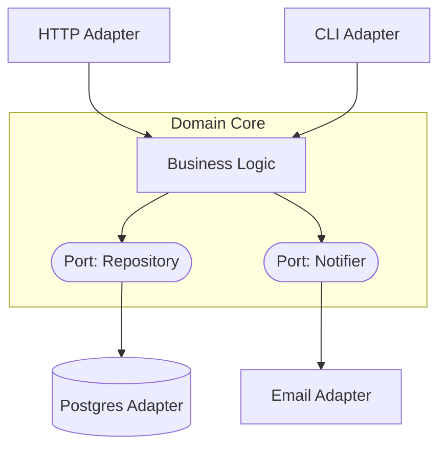

# Hexagonal Architecture (Ports & Adapters)

The domain sits at the center, knowing nothing about the outside world. It defines **ports** (interfaces); the outside world — HTTP, databases, brokers, third-party APIs — plugs in through **adapters** that implement those ports. The dependency arrow points *inward*.



## Context & forces

A *style* applicable within any of the deployment shapes (it composes with monolith, modular monolith, or a microservice). Reach for it when the business logic is valuable and long-lived but the infrastructure isn't, when you need to test the domain with **zero infrastructure**, and when you expect surrounding tech to change — which, over a 5-year horizon, it always does. It's the structural expression of the Dependency Inversion Principle at the architecture level.

## Quality-attribute profile

| Attribute | Rating | Note |
|---|:--:|---|
| Maintainability / evolvability | ●●● | Infra swaps don't touch the domain |
| Testability | ●●● | Domain tested with in-memory adapters |
| Consistency | ●●● | Orthogonal — inherits the deployment's model |
| Time-to-market | ●●○ | Upfront indirection cost |
| Operability | ●●○ | Neutral; depends on deployment shape |

## Consequences & failure modes

The trade-off is **ceremony**. For a thin CRUD service whose "domain logic" is forwarding a request to the database, ports and adapters add files and interfaces that buy nothing — that's cosplay, not architecture. Hexagonal earns its keep only when there is real logic to protect. The other failure: leaking infrastructure types (an ORM entity, an HTTP request object) *through* a port into the domain, which silently re-couples the core to the edge.

## Operational concerns

- **Composition root:** one place wires concrete adapters into the domain (see `index.ts`). Keep adapter selection (config/DI) out of the domain.
- **Testing strategy:** fast unit tests against in-memory adapters for the domain; a thin layer of integration tests per real adapter.
- **Evolution:** swapping Postgres → DynamoDB, or REST → gRPC, is a new adapter, not a domain change.

## Anti-patterns

- **Hexagonal for CRUD** — indirection with no behavior to protect.
- **Leaky ports** — infrastructure types crossing the boundary into the domain.
- **Anemic core** — all logic in "application services," none in the domain, so the center is hollow.

## What to look at (runnable reference)

- [`src/domain.ts`](./src/domain.ts) — the core; imports only `./ports`, never `./adapters`. Contains a real rule (no duplicate email).
- [`src/ports.ts`](./src/ports.ts) — interfaces the domain owns.
- [`src/adapters.ts`](./src/adapters.ts) — in-memory repository + stub notifier; a Postgres adapter is sketched to show the swap is one new file.
- [`src/domain.test.ts`](./src/domain.test.ts) — tests the business rule with **zero infrastructure**.

```bash
cd hexagonal && npm install && npm test
```

The whole pattern in one observation: read `domain.ts` and note it imports nothing from `adapters.ts`. The arrow points inward.

## Related patterns & references

- Composes with → [Modular Monolith](../modular-monolith), [Microservices](../microservices).
- Alistair Cockburn — *Hexagonal Architecture* (the original); Robert C. Martin — *Clean Architecture*; Jeffrey Palermo — *Onion Architecture*.
