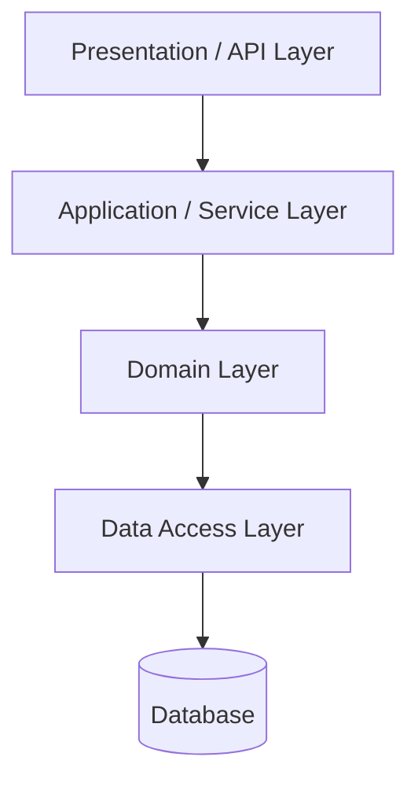

# Layered (N-tier) Architecture

Presentation → Application/Service → Domain → Data Access. Each layer depends only on the one below it (the **dependency rule**). The default starting structure, and the one most teams already have whether they named it or not.



## Context & forces

Reach for layered when the domain is small, the team is small (1–10), and time-to-market dominates. Its value is *familiarity*: a new engineer can find where code goes without a map, and the structure is boring in the way early-stage software should be. It is a single deployable with a single datastore — strong consistency comes for free via local transactions.

## Quality-attribute profile

| Attribute | Rating | Note |
|---|:--:|---|
| Time-to-market | ●●● | Lowest ceremony; everyone knows it |
| Operability | ●●● | One deployable, one stack trace |
| Consistency | ●●● | Single DB, local ACID transactions |
| Cost (TCO) | ●●● | Minimal moving parts |
| Maintainability | ●●○ | Good early; degrades as logic leaks |
| Scalability | ●○○ | Scales as a unit; the DB is the ceiling |

## Consequences & failure modes

Layered architecture rots in a predictable direction: business logic leaks **up** into controllers and **down** into the database (fat ORM models, stored procedures), until the "domain layer" is an anemic bag of getters and setters. **The diagnostic:** if you can't unit-test a business rule without spinning up a database, the layers have already collapsed. The other failure is treating layers as a license to add indirection with no behavior — a "service" that only forwards to a "repository" that only forwards to the ORM.

## Operational concerns

- **Scaling:** horizontal replicas behind a load balancer; the shared database becomes the bottleneck — plan read replicas and caching before you need them.
- **Observability:** trivial (one process) — but instrument the data-access layer; slow queries are the usual culprit.
- **Evolution:** when the domain grows, evolve *toward* a [modular monolith](../modular-monolith) by introducing real module boundaries — don't jump to microservices.

## Anti-patterns

- **Anemic domain model** — all logic in services, none in domain objects.
- **Layer-skipping** — presentation reaching straight into data access "just this once."
- **Indirection without behavior** — layers that only pass through, adding cost with no value.

## What to look at (runnable reference)

- [`src/domain.ts`](./src/domain.ts) — real business rules (bulk-discount pricing, stock invariants), pure and infrastructure-free.
- [`src/service.ts`](./src/service.ts) — orchestrates the use case; coordinates, doesn't contain rules.
- [`src/data.ts`](./src/data.ts) / [`src/api.ts`](./src/api.ts) — the bottom and top layers; the dependency rule points downward only.
- [`src/layered.test.ts`](./src/layered.test.ts) — note the domain is tested with **zero infrastructure** — the payoff of honest layering.

```bash
cd layered && npm install && npm test
```

## Related patterns & references

- Evolve to → [Modular Monolith](../modular-monolith); protect the domain with → [Hexagonal](../hexagonal).
- Fowler — *Patterns of Enterprise Application Architecture* (layering, domain model vs transaction script).
- Companion article: [Common System Architectures](https://ruchitsuthar.com/blog/software-architecture/common-system-architectures-reference-catalog/).
