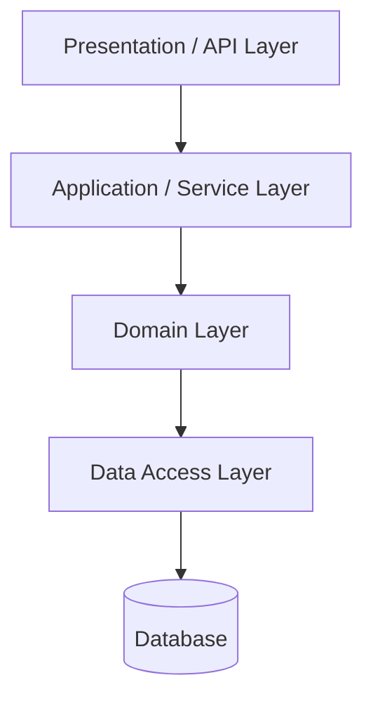

# Layered (N-tier) Architecture

The default. Presentation → application/service → domain → data access. Each layer talks only to the one below it.

## Use it when
- You're starting out, the domain is small, and you need to ship.
- You want a structure every engineer already understands without a map.
- Boring is a feature — you're still finding product-market fit.

## How it goes wrong
Layered architecture rots predictably: business logic leaks **up** into controllers and **down** into the database (stored procedures, fat ORM models) until the "domain layer" is an anemic bag of getters and setters. The tell: a 600-line service method orchestrating everything while no domain object does any actual thinking. If you can't unit-test a business rule without a database, the layers have collapsed.

## The dependency rule
Dependencies point **inward/downward only**. Presentation never reaches past the service layer into data access. Enforce it with package boundaries and an architecture test, not a wiki note.

## What to look at (reference implementation)
A clean three-layer service where the dependency rule is enforced by package structure, and the domain layer holds real, independently testable logic.

> Implementation: scaffolded. See the [companion article](https://ruchitsuthar.com/blog/software-architecture/common-system-architectures-reference-catalog/) for the pattern; contributions welcome.
