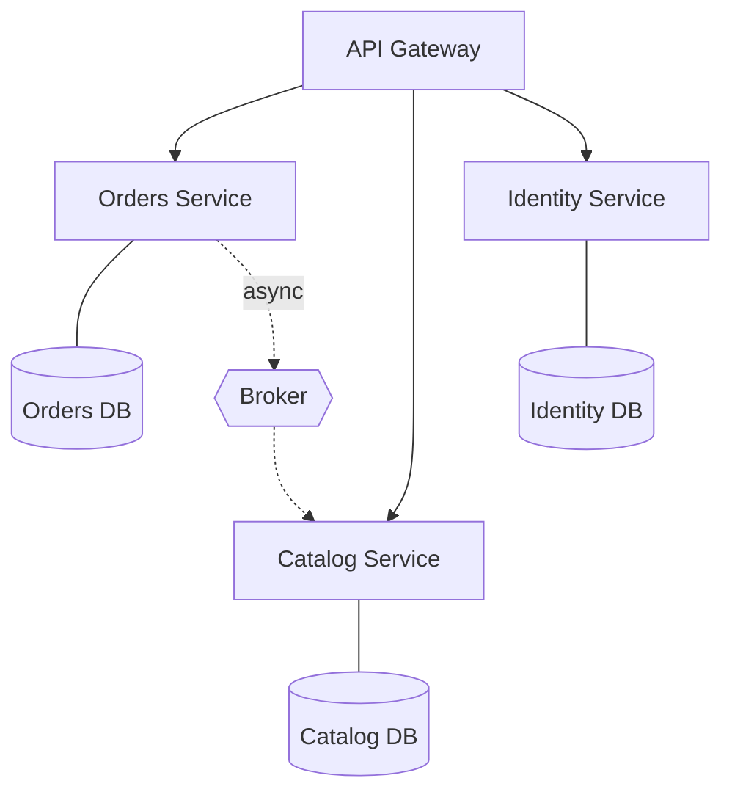

# Microservices

The business is decomposed into independently deployable services, each owning its data and aligned to a **business capability**. They communicate over the network, synchronously or asynchronously.



## Context & forces

The real driver is **organizational, not technical**: enough engineers (think 30+, multiple teams) that coordinating deploys in one codebase has become the bottleneck. Microservices let independent teams own, deploy, and scale their piece on their own cadence — Conway's Law as a design tool. Independent scaling, fault isolation, and polyglot freedom are real but **secondary**. Below that organizational threshold, a [modular monolith](../modular-monolith) gives you the boundaries without the distribution tax.

## Quality-attribute profile

| Attribute | Rating | Note |
|---|:--:|---|
| Scalability | ●●● | Scale each service independently |
| Availability | ●●● | Fault isolation (with bulkheads/breakers) |
| Team autonomy / evolvability | ●●● | Independent deploy cadence at scale |
| Consistency | ●○○ | No cross-service transactions → sagas |
| Operability | ●○○ | Distributed tracing, many pipelines, on-call surface |
| Cost / time-to-market | ●○○ | High platform + cognitive overhead |

## Consequences & failure modes

The pattern is routinely adopted prematurely, producing a **distributed monolith** — all the cost of distribution, none of the independence. Causes: services drawn on **technical** lines ("a database service," "an auth service") so every feature crosses boundaries; **distributed transactions** faked without a saga or compensation; **shared databases** that couple services through the back door. The diagnostic question for any proposed split: *"Can one team ship a meaningful feature in their service without coordinating a deploy with another team?"* If no, it's a distributed monolith.

## Operational concerns (the prerequisites)

You should not run microservices without: CI/CD per service, **distributed tracing** + centralized logging + per-service RED metrics, an **API gateway** (auth, routing, rate limiting), **per-service databases** (no shared schemas), **resilience patterns** ([circuit breakers, retries with backoff+jitter, bulkheads](https://ruchitsuthar.com/blog/software-architecture/caching-idempotency-retries-at-scale/)), and **sagas with compensation** for cross-service workflows. Missing these, the operational cost dwarfs the benefit.

## Anti-patterns

- **Distributed monolith** — services that must deploy together.
- **Nanoservices** — so fine-grained that overhead exceeds the work done.
- **Shared database** — back-door coupling.
- **Microservices for a small team** — solving an org problem you don't have.

## What to look at (runnable reference)

A **saga** — the alternative to the (impossible) distributed transaction across services that don't share a database.

- [`src/saga.ts`](./src/saga.ts) — a generic `SagaOrchestrator`: each step has an action and a **compensation**; on failure, completed steps roll back **in reverse order**.
- [`src/order-saga.ts`](./src/order-saga.ts) — three independent services (payment, inventory, shipping) wired into an order saga.
- [`src/saga.test.ts`](./src/saga.test.ts) — happy path completes; when shipping fails, payment is refunded and inventory released (state rolled back, no partial order).

```bash
cd microservices && npm install && npm test
```

## Related patterns & references

- Decompose from → [Modular Monolith](../modular-monolith); backbone → [Event-Driven](../event-driven); applied in [social-media](../examples/social-media) (full split) and [banking](../examples/banking) (saga only at external boundaries).
- Sam Newman — *Building Microservices*; Chris Richardson — *Microservices Patterns* (saga, API gateway); Skelton & Pais — *Team Topologies*.
