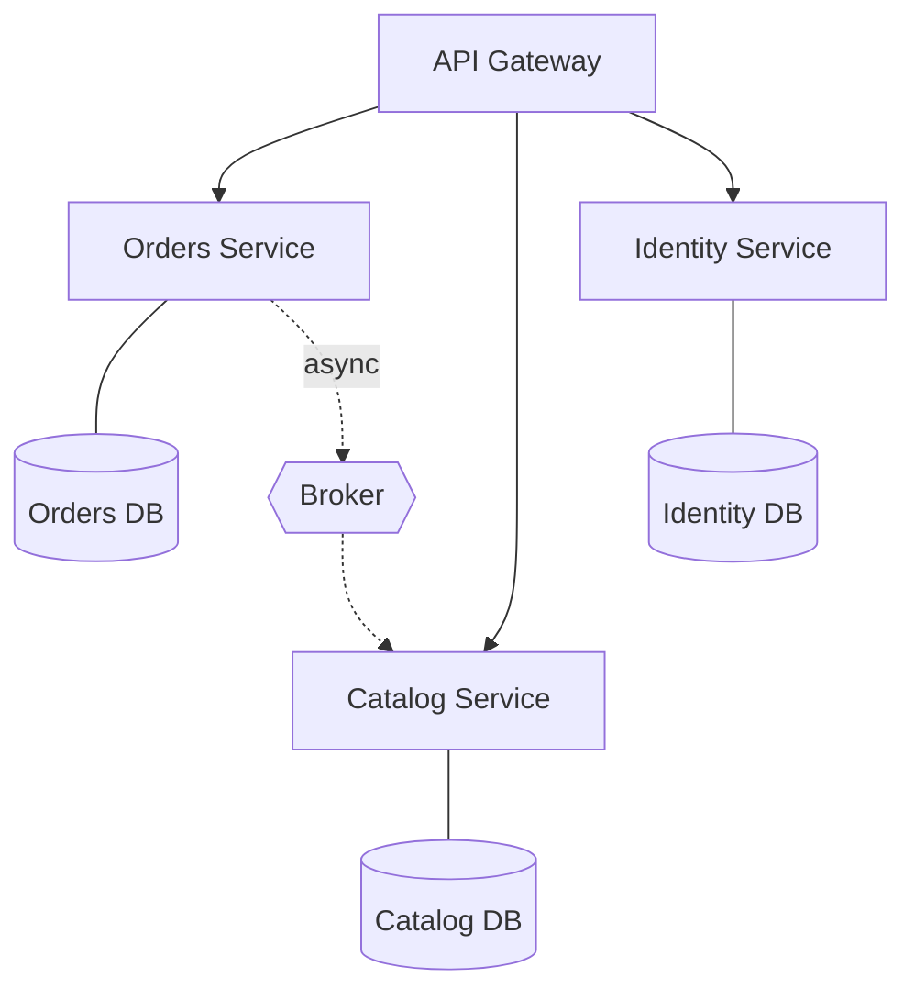

# Microservices

The business is decomposed into independently deployable services, each owning its data and aligned to a **business capability**. They communicate over the network, sync or async.



## Use it when
The real driver is **organizational, not technical**: you have enough engineers (think 30+, multiple teams) that coordinating deploys in a single codebase has become the bottleneck. Microservices let independent teams own, deploy, and scale their piece on their own cadence. Independent scaling, fault isolation, and polyglot freedom are real but **secondary** benefits. Conway's Law is your design tool here.

## How it goes wrong
- Services drawn along **technical lines** (a "database service," an "auth service") instead of business capabilities — so every feature crosses boundaries.
- **Distributed transactions** faked with no saga or compensation.
- **Shared databases** that couple services through the back door.

### The diagnostic question
> *"Can a single team ship a meaningful feature in their service without coordinating a deploy with another team?"*

If no, you have a **distributed monolith** — all the cost of distribution, none of the independence.

## Essential supporting patterns
- **Saga** for cross-service workflows (with compensation), instead of distributed transactions.
- **API gateway** for a single entry point, auth, and routing.
- **Per-service database** — no shared schemas.
- Async events for decoupling where a synchronous answer isn't required.

## What to look at (runnable reference)

This folder contains a **runnable** TypeScript saga — the alternative to the (impossible) distributed transaction across services that don't share a database.

- [`src/saga.ts`](./src/saga.ts) — a generic `SagaOrchestrator`: each step has an `action` and a `compensate` (undo). If any step fails, it runs the compensations for the completed steps **in reverse order**.
- [`src/order-saga.ts`](./src/order-saga.ts) — three independent services (payment, inventory, shipping), each owning its own state, wired into an order saga.
- [`src/saga.test.ts`](./src/saga.test.ts) — proves the happy path completes, and that when shipping fails the payment is refunded and inventory released (state rolled back, no partial order left behind).

### Run it

```bash
cd microservices
npm install
npm test     # happy path + two failure/compensation scenarios
npm start    # demo: a successful order and a failed one that rolls back
```

The line to internalize: there is no distributed `BEGIN…COMMIT` across services. A saga gives you "all-or-nothing" by making every step's **undo** a first-class citizen.

Companion article: [Event-Driven Architecture Without the Hype](https://ruchitsuthar.com/blog/software-architecture/event-driven-architecture-without-the-hype/) (choreography vs orchestration).
