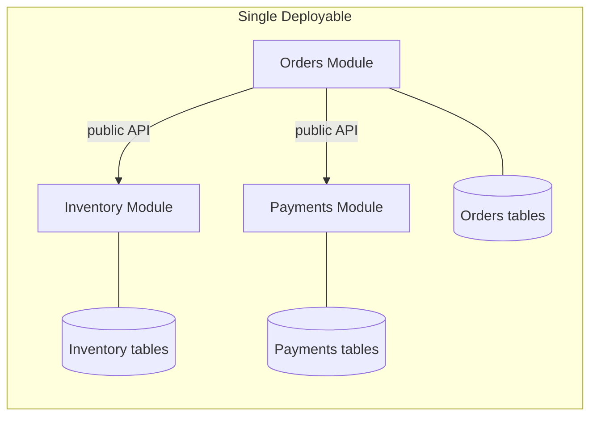

# Modular Monolith

A single deployable unit, internally divided into modules with explicit, **enforced** boundaries. Each module owns its data and exposes a narrow interface. The boundaries are real — they're just not network boundaries.

## Use it when
**This is the right default for almost every team under ~30 engineers.** You get the organizational benefits people *think* they need microservices for — clear ownership, independent reasoning, the ability to extract a service later — without the distributed-systems tax. You deploy once, debug with a single stack trace, and run transactions across modules when you genuinely need to. The module boundaries become your future service boundaries *if* you ever need them.

## How it goes wrong
The boundaries aren't enforced, so they erode. Module A reaches into Module B's tables "just this once," and eighteen months later you have a big ball of mud wearing a modular costume.

## Enforce boundaries with tooling, not intentions
- Separate schemas per module (no cross-schema joins).
- A dependency/architecture test that **fails the build** on a boundary violation (ArchUnit, dependency-cruiser, or compiler-level modules).
- Communication between modules only through published interfaces or domain events.

## What to look at (reference implementation)
Modules with separate schemas and a dependency test that fails CI when one module imports another's internals.

> Implementation: scaffolded. See the [companion article](https://ruchitsuthar.com/blog/software-architecture/common-system-architectures-reference-catalog/); contributions welcome.
