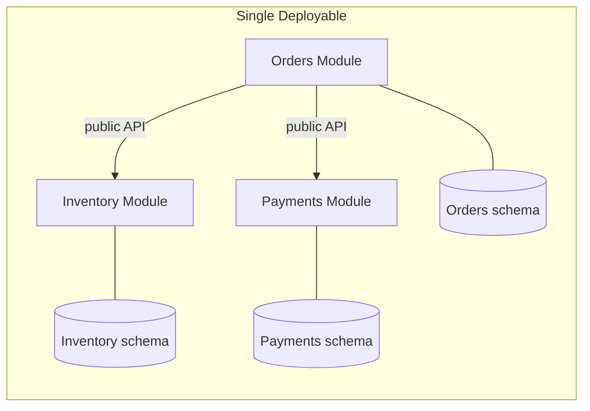

# Modular Monolith

A single deployable, internally divided into modules with **explicit, enforced** boundaries. Each module owns its data and exposes a narrow public interface. The boundaries are real — they're just not network boundaries.



## Context & forces

**The right default for almost every team under ~30 engineers.** It delivers the organizational benefits teams *think* they need microservices for — clear ownership, independent reasoning, a future extraction path — without the distributed-systems tax. You deploy once, debug a single stack trace, run cross-module transactions when you genuinely need to, and the module boundaries become your service boundaries *if* you ever actually need them. Optimizes for reversibility: a clean module extracts to a service in an afternoon; the reverse is a rewrite.

## Quality-attribute profile

| Attribute | Rating | Note |
|---|:--:|---|
| Maintainability / evolvability | ●●● | Clear boundaries; cheap to refactor |
| Consistency | ●●● | One DB → cross-module ACID when needed |
| Operability | ●●● | Single deployable; one trace |
| Time-to-market | ●●○ | Slightly more upfront than layered |
| Scalability | ●●○ | Scales as a unit; partition the DB |
| Team-topology fit | ●●● | Module-per-team within one codebase |

## Consequences & failure modes

The one failure mode: **unenforced boundaries erode.** A module reaches into another's tables "just this once," and eighteen months later you have a big ball of mud in a modular costume. The mitigation is non-negotiable — enforce boundaries with **tooling, not wishes**: separate schemas (no cross-schema joins), an architecture/dependency test that **fails CI** on a boundary violation, and cross-module communication only through published interfaces or domain events.

## Operational concerns

- **Data:** schema-per-module; if you later extract a service, that module's schema goes with it.
- **Scaling:** vertical + replicas + DB partitioning; if one module is a hotspot, that's your first extraction candidate.
- **Evolution to microservices:** extract along existing module seams, one at a time, only when an *organizational* need (independent deploy cadence at 30+ engineers) appears — see the [decision method](../docs/choosing-an-architecture.md).

## Anti-patterns

- **Boundaries by convention only** — documented in a wiki, unenforced in code.
- **Premature extraction** — splitting into services before the org needs it.
- **Shared mutable tables across modules** — the back-door coupling that defeats the whole point.

## What to look at (runnable reference)

- [`src/modules/inventory`](./src/modules/inventory) and [`src/modules/orders`](./src/modules/orders) — each with a private `internal/` store and a public `index.ts`. Orders calls Inventory **only** through its public port.
- [`src/boundaries.test.ts`](./src/boundaries.test.ts) — two tests: the cross-module call works via the public API, **and an architecture test that scans the source and fails the build if any module imports another module's `internal/`**. That ~15-line check is the dependency-cruiser/ArchUnit idea — the thing that actually keeps the boundaries from rotting.

```bash
cd modular-monolith && npm install && npm test
```

## Related patterns & references

- Start from → [Layered](../layered); extract to → [Microservices](../microservices) when the org demands it; isolate domains with → [Hexagonal](../hexagonal).
- Tooling: ArchUnit (JVM), dependency-cruiser / eslint boundaries (JS/TS), compiler module systems.
- Companion article: [Common System Architectures](https://ruchitsuthar.com/blog/software-architecture/common-system-architectures-reference-catalog/).
