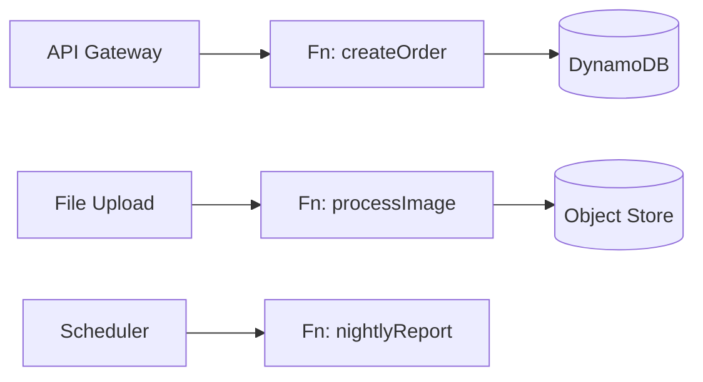

# Serverless / Function-as-a-Service

Code runs in managed, ephemeral compute (Lambda, Cloud Functions) triggered by events. No servers to manage; you pay per invocation and scale to zero.

## Use it when
- Spiky, event-driven, or low-baseline-traffic workloads where paying for idle servers is wasteful.
- Glue code, scheduled jobs, image processing, webhook handlers.
- Early MVPs where you want zero ops and scale-to-zero economics.

## How it goes wrong
- **Cold starts** on latency-sensitive paths.
- **Vendor lock-in** that's deeper than people admit — your whole event wiring becomes proprietary.
- **Local dev and testing** that fight you.
- **Cost inversion**: cheap at low/spiky volume, but can be dramatically *more* expensive than a boring container at steady high throughput.
- **"Lambda pinball"** — dozens of functions calling each other recreate the microservices reasoning problem with worse observability.

## Tactics that help
- Provisioned concurrency / keep-warm for latency-sensitive functions.
- Infrastructure-as-Code for the whole pipeline (functions + triggers + permissions).
- Local emulation so the inner loop doesn't require a deploy.
- Model your real request volume before committing — find where the cost curve crosses a container.

## What to look at (reference implementation)
An IaC-defined function pipeline (API → function → store) with local emulation so you can run it without deploying to a cloud account.

> Implementation: scaffolded. See the [companion article](https://ruchitsuthar.com/blog/software-architecture/common-system-architectures-reference-catalog/); contributions welcome.
