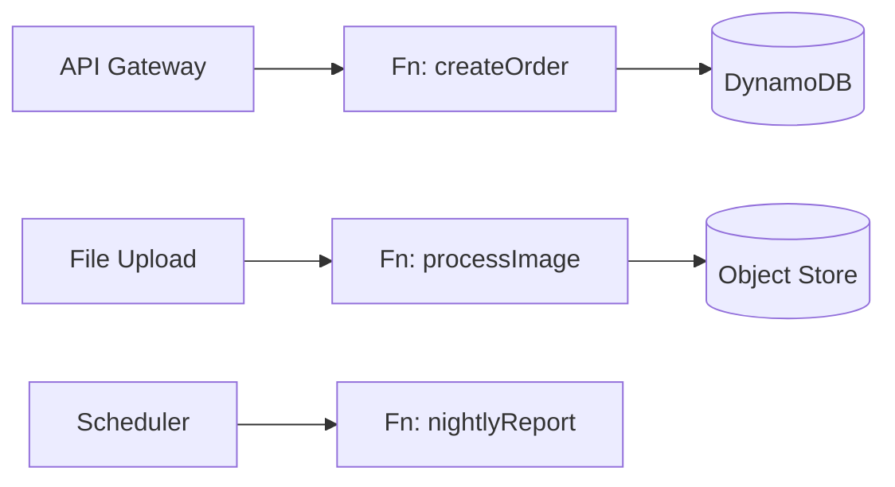

# Serverless / Function-as-a-Service

Code runs in managed, ephemeral compute (Lambda, Cloud Functions, Cloud Run jobs) triggered by events. No servers to manage; you pay per invocation and scale to zero.



## Context & forces

Reach for serverless for **spiky, event-driven, or low-baseline** workloads where paying for idle servers is wasteful: glue code, scheduled jobs, webhook handlers, media processing, and early MVPs where you want zero ops. Scale-to-zero is genuinely powerful for unpredictable load. The unit is a small, stateless, single-purpose handler.

## Quality-attribute profile

| Attribute | Rating | Note |
|---|:--:|---|
| Scalability (elastic) | ●●● | Auto-scales per invocation, to zero |
| Availability | ●●● | Managed, multi-AZ by default |
| Time-to-market | ●●● | No infra to stand up |
| Cost (low/spiky load) | ●●● | Pay-per-use; **inverts at steady high load** |
| Latency | ●●○ | Cold starts on idle/spiky paths |
| Operability / portability | ●●○ | Great managed ops, but deep vendor lock-in |

## Consequences & failure modes

- **Cold starts** hurt latency-sensitive paths (mitigate: provisioned concurrency / keep-warm).
- **Cost inversion** — cheap at low/spiky volume, often *more* expensive than a well-utilized container at steady high throughput. Model real volume before committing.
- **Vendor lock-in** runs deeper than people admit — your event wiring, IAM, and triggers become proprietary.
- **"Lambda pinball"** — dozens of functions calling each other recreate the microservices reasoning problem with worse observability.
- **Local dev/testing** fights you unless you design for it.

## Operational concerns

- **Infrastructure-as-Code** for the whole pipeline (functions + triggers + permissions) — it's the only sane way to manage the sprawl.
- **Local emulation** so the inner loop doesn't require a deploy (the reference below makes handlers pure and runnable locally).
- **Observability:** per-function metrics, structured logs, and tracing across the event cascade; watch concurrency limits and throttling.
- **Statelessness:** push all state to managed stores; handlers must assume nothing persists between invocations.

## Anti-patterns

- **Serverless for steady high-throughput** services — pay more for worse latency.
- **Distributed-monolith-of-functions** — tightly coupled function chains with no clear boundaries.
- **Hidden state** in a function instance that happens to stay warm.

## What to look at (runnable reference)

A local FaaS runtime so you can run/test the model without a cloud account.

- [`src/runtime.ts`](./src/runtime.ts) — a tiny runtime: functions registered against triggers (`http:` / `event:` / `schedule:`); emitted events **cascade** to their handlers (fan-out).
- [`src/functions.ts`](./src/functions.ts) — small, stateless handlers; pure-ish (event in, result out, side effects via injected store) — which is exactly what makes them testable in isolation.
- [`src/functions.test.ts`](./src/functions.test.ts) — handlers unit-tested **in isolation**, plus the full http→event→processing pipeline through the runtime.

```bash
cd serverless && npm install && npm test
```

## Related patterns & references

- Often combined with → [Event-Driven](../event-driven); an alternative decomposition to → [Microservices](../microservices) for the right workloads.
- AWS Well-Architected — Serverless Lens; Jeremy Daly's serverless patterns; the [decision matrix](../docs/choosing-an-architecture.md) for the cost/latency cross-over.
