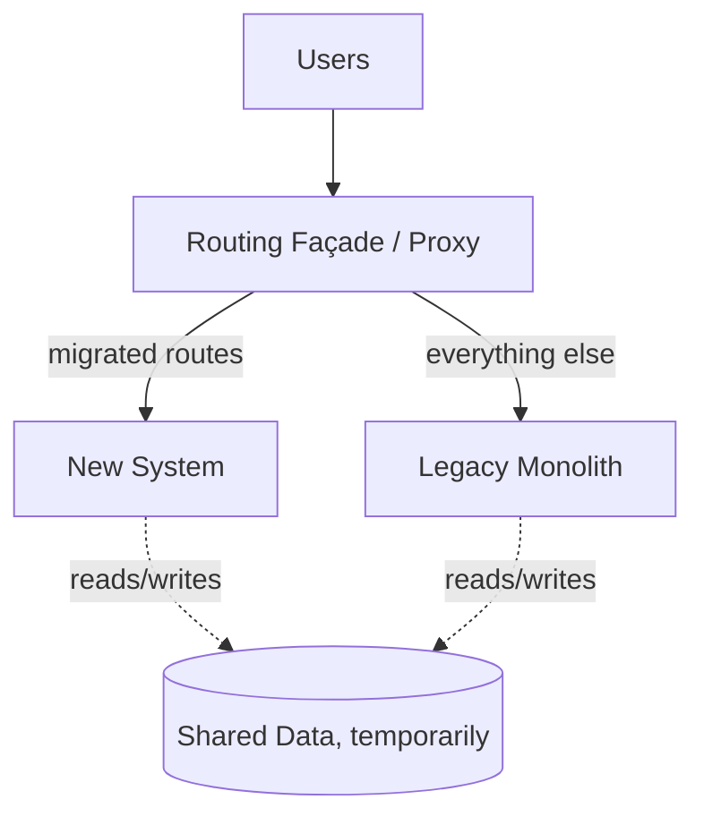

# Strangler Fig (Migration Pattern)

Not a target architecture — a **migration** strategy. You incrementally replace a legacy system by routing slices of functionality to new code behind a façade, until the old system is "strangled" and can be retired. Named after the vine that grows around a tree and eventually replaces it.



## Context & forces

Reach for the strangler fig whenever you must modernize a legacy system that is **too risky for a big-bang rewrite** — which is every legacy system worth its salt. It lets you ship value continuously, prove each slice in production, and keep a working system the entire time. No flag day, no 18-month rewrite that gets cancelled at month 14. This is a risk-management pattern first and an architecture pattern second.

## Quality-attribute profile (as a migration)

| Attribute | Rating | Note |
|---|:--:|---|
| Risk reduction | ●●● | Incremental, reversible, always-shippable |
| Continuous delivery of value | ●●● | New capabilities land throughout |
| Reversibility / safety | ●●● | Per-route rollback at any time |
| Operational overhead (transitional) | ●○○ | Two systems + façade run concurrently |
| Data consistency (transitional) | ●●○ | The shared-data phase needs care |

## Consequences & failure modes

The signature failure: the migration **stalls at ~60%**. The easy slices go first; the gnarly core is left for "later," and "later" never beats new features — so you maintain *two* systems plus the façade indefinitely. Mitigations: **sequence around business value**, not technical convenience; set a **hard decommission date** for the legacy system with executive air cover (a strangler fig with no deadline is just two systems); and treat the **shared-data phase** as deliberate, temporary coupling — it's where correctness bugs hide.

## Operational concerns

- **The façade/proxy** is critical infrastructure — it needs HA, observability, and low latency; it sees all traffic.
- **Metrics-based cutover:** route a canary % to the new path, compare error/latency/correctness, then ramp. Keep **instant rollback**.
- **Data migration & sync** during the shared phase (CDC, dual-write with reconciliation, or read-from-new/write-to-both) — choose explicitly and verify with reconciliation.
- **Parity testing:** shadow traffic to the new path and diff outputs against legacy before cutover.

## Anti-patterns

- **No decommission deadline** — the migration that never finishes.
- **Easy-first sequencing** — leaving the hard core for a "later" that never comes.
- **Big-bang disguised as strangler** — flipping everything at once behind the façade.

## What to look at (runnable reference)

- [`src/facade.ts`](./src/facade.ts) — the routing façade: per-route mode (`legacy` / `canary %` / `new`), traffic metrics for data-driven cutover, and **instant rollback**. The canary roll is injectable so routing is deterministic in tests.
- [`src/services.ts`](./src/services.ts) — legacy and new implementations behind the same contract.
- [`src/facade.test.ts`](./src/facade.test.ts) — unmigrated → legacy; full cutover → new (others untouched); canary splits deterministically; rollback returns to legacy; metrics record the split.

```bash
cd strangler-fig && npm install && npm test
```

## Related patterns & references

- Migrate *toward* any catalog target ([modular monolith](../modular-monolith), [microservices](../microservices)); the [banking example](../examples/banking) notes it as the realistic path off a legacy core-banking mainframe.
- Martin Fowler — *StranglerFigApplication*; Sam Newman — *Monolith to Microservices*.
