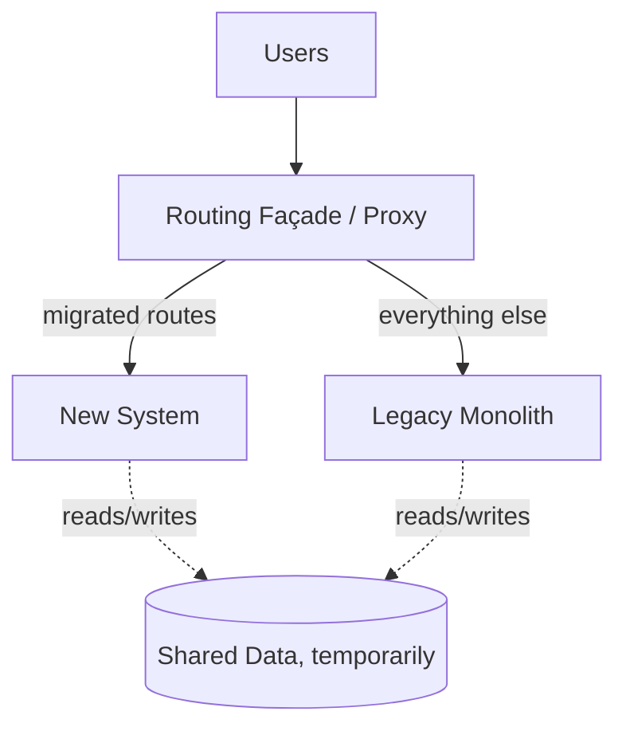

# Strangler Fig (Migration Pattern)

Not a target architecture — a **migration** architecture. You incrementally replace a legacy system by routing slices of functionality to new code behind a façade, until the old system is "strangled" and can be removed. Named after the vine that grows around a tree and eventually replaces it.

## Use it when
- You have a legacy system too risky for a "big bang" rewrite (i.e., every legacy system worth its salt).
- You need to ship value continuously and keep a working system the entire time.
- You want to prove each migrated slice in production — no flag day, no 18-month rewrite that gets cancelled at month 14.

## How it goes wrong
The migration **stalls at 60%** because the easy parts went first and the hard, gnarly core was left for "later" — and "later" never beats new features. Now you maintain *two* systems forever, plus the façade.

## Make it succeed
- **Sequence around business value**, not technical convenience.
- Set a **hard decommission date** for the legacy system, with executive air cover. A strangler fig with no deadline is just two systems.
- Migrate **one route/capability at a time**, with metrics-based cutover and instant rollback.
- Plan the **shared-data** phase deliberately — it's temporary coupling, and it's where correctness bugs hide.

## What to look at (reference implementation)
A routing façade that migrates one endpoint at a time, with a metrics-based cutover toggle and rollback.

> Implementation: scaffolded. See the [companion article](https://ruchitsuthar.com/blog/software-architecture/common-system-architectures-reference-catalog/); contributions welcome.
